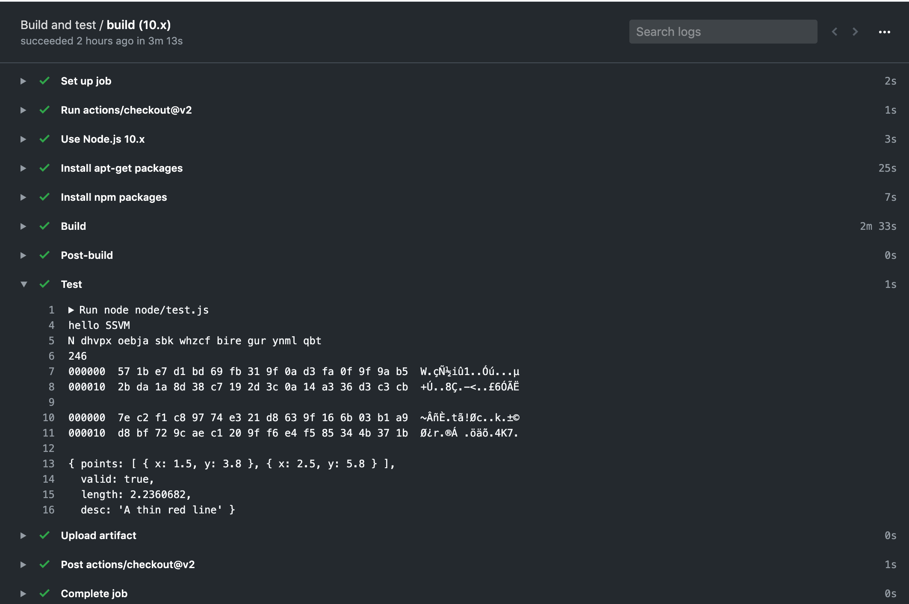
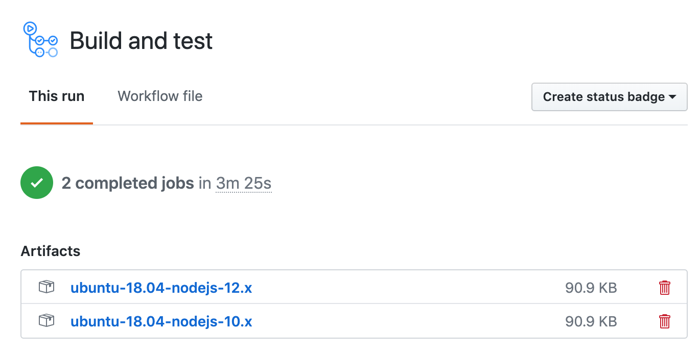

# The no software approach

In the [previous tutorial](./), we discussed how to create a hybrid JavaScript + Rust application for Node.js. In this tutorial, I will show you how to experiment with development without installing any developer tools software.

\*\*\*\*[**Fork this GitHub repository**](https://github.com/second-state/ssvm-nodejs-starter) to get started. In your fork, you can use GitHub's web UI to edit source code files.

* The Rust files are in the `src` directory. You can put high performance workload into Rust functions. The Rust build and dependency configuration is in the `Cargo.toml` file.
* The JavaScript files are in the `node` directory and they can access the Rust functions.
  * The `node/test.js` file contains the test cases.
  * The `node/app.js` file contains the application.

Every time you push changes to the source code, GitHub Actions will build the application and run the test cases in `node/test.js`. You can see the console output from the Actions tab on GitHub.



The build results are stored in the Action artifact. 



You can download the artifact, unzip it, and run the Node.js application. You do need to install Node.js on your computer to run the  application in `node/app.js`.

```text
// Install the ssvm addon to Node.js
$ npm install ssvm
// Download and unzip the artifact
$ unzip download.zip
$ cd download
// Run the Rust + JavaScript hybrid application
$ node node/app.js
```

That's it! Now continue to see more examples on how to build [complex](../rust-javascript-data-exchange.md) Rust + JavaScript hybrid applications for cryptography, machine learning, data management, and artificial intelligence.

