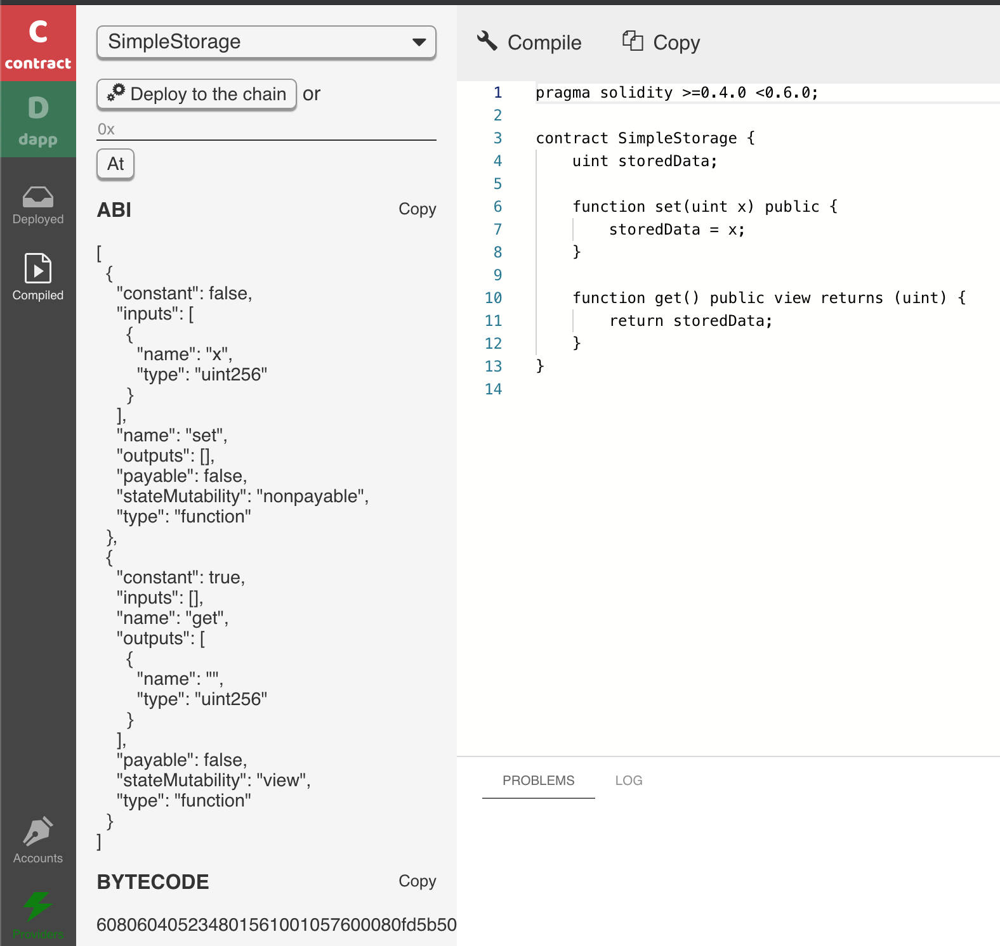

# Data-driven DApps

The [Getting started guide](getting-started.md) showcased a number storage contract and DApp. In this section, we will use the same smart contract, but to develop a new DApp that highlights data capabilities of the Second State platform, which supports [web3](https://github.com/second-state/web3-ss.js) for transactional data and [elastic search](https://github.com/second-state/es-ss.js) for state data. The complete source code for this example is [available here](https://gist.github.com/juntao/bb63b952119c3e4c56bd56601c9140c3).

**Access the BUIDL IDE from your browser:** [**https://buidl.secondstate.io/**](https://buidl.secondstate.io/)\*\*\*\*

Let’s first see how the DApp works. It displays all the storage contracts deployed on the blockchain, and then allows the user to store numbers in those contracts.


Now, let’s review the code to see how this is done.

#### Step 1: Copy and paste the following code into contract tab.



Compile and deploy the smart contract via the **Compile** and **Deploy** buttons as we did in the [Getting started guide](getting-started.md).



#### Step 2: Copy and paste the follow HTML code into the dapp -&gt; HTML tab



The HTML code demonstrates how to use the bootstrap 4 CSS framework. If you have additional CSS style rules for this page, you can put them in the CSS tab.

The HTML renders a button to create new storage contracts, as well as a table that lists all the contracts. The table is initially empty, and will be filled by the JavaScript, which we see next.

#### Step 3: Copy and paste the following into the dapp -&gt; JS tab



The `reload()` function in the JS code below calls the elastic search API to get all contracts with the ABI from the blockchain. It then constructs a table body to display those contracts. Notice that the current state, ie the stored number, of each contract is also contained in the search result. We can simply display this information without having to interact with the slower blockchain nodes.

```text
function reload () {
  esss.shaAbi(JSON.stringify(abi)).then((shaResult) => {
    var sha = JSON.parse(shaResult).abiSha3;
    esss.searchUsingAbi(sha).then((searchResult) => {
      var items = JSON.parse(searchResult);
        // Puts the items into the table
      });
    });
  });
```

The **Set Data** buttons in the table trigger the `setData()` JS function, which in turn calls the contract’s `set()` function via web3.

```text
function setData (element) {
  instance = contract.at(element.id);
  var n = window.prompt("Input a number:");
  n && instance.set(n);
}
```

The **Create new storage** button triggers the `create()` JS function to create a new contract on the blockchain. It works as follows.

```text
function create (element) {
  element.innerHTML = "Wait ...";
  var data = '0x' + contract.new.getData({data:bytecode});
  contract.new({
    data: data
  }, function (ee, i) {
    // ...
  });
}
```

#### Step 4: Hit the Run button to launch the DApp

You will see the web app running inside the right panel. You can now create a new storage contract, and then change its stored number.

In this article, we demonstrated how to use [web3](https://github.com/second-state/web3-ss.js) and [elastic search](https://github.com/second-state/es-ss.js) APIs together to build high performance and data driven DApps. The [FairPlay DApp](https://www.fairplaydapp.com/) is a successful real world example based on [this approach](../white-papers/fairplay-a-new-type-of-dapp.md).

In the next article, we will show how to write rule-based smart contracts in BUIDL.


