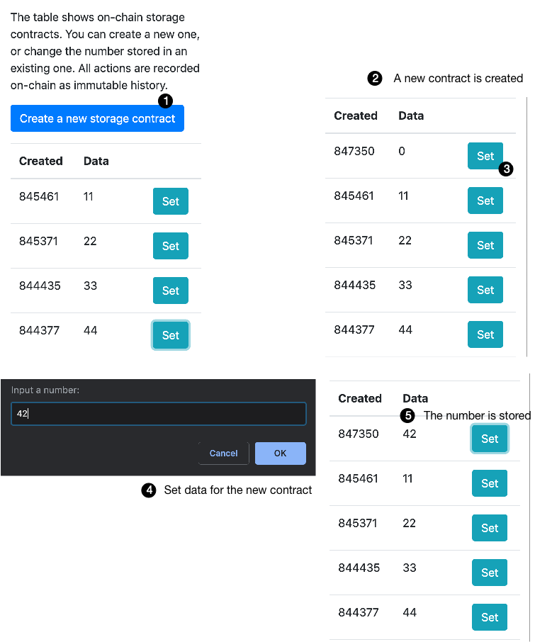

# Create and index contracts

In the previous article, we showed how to use the smart contract search engine together with web3 to update and keep track of data states of smart contracts. In this example, we will further explain how to create a smart contract from your DApp and index it with the search engine.

**Access the BUIDL IDE from your browser:** [**https://buidl.secondstate.io/**](https://buidl.secondstate.io/)\*\*\*\*



Let’s first see how the DApp works. It displays all the storage contracts deployed on the blockchain, and then allows the user to store numbers in those contracts. But most importantly, it allows users to create new storage contracts, and have them immediately indexed and displayed in the DApp.



Now, let’s review the code to see how this is done.

#### Step 1: Copy and paste the following code into contract tab

```typescript
pragma solidity >=0.4.0 <0.6.0;

contract SimpleStorage {
    uint storedData;

    function set(uint x) public {
        storedData = x;
    }

    function get() public view returns (uint) {
        return storedData;
    }
}
```

Compile and deploy the smart contract via the **Compile** and **Deploy to the chain** buttons as we did in the [Getting started guide](../getting-started/).


#### Step 2: Copy and paste the follow HTML code into the dapp -&gt; HTML tab

```markup
<!doctype html>
<html lang="en">
  <head>
    <!-- Required meta tags -->
    <meta charset="utf-8">
    <meta name="viewport" content="width=device-width, initial-scale=1, shrink-to-fit=no">
    <!-- Bootstrap CSS -->
    <link rel="stylesheet" href="https://stackpath.bootstrapcdn.com/bootstrap/4.3.1/css/bootstrap.min.css" integrity="sha384-ggOyR0iXCbMQv3Xipma34MD+dH/1fQ784/j6cY/iJTQUOhcWr7x9JvoRxT2MZw1T" crossorigin="anonymous">
    
    <title>Data Stores</title>
  </head>
  <body>
    <div class="container">
        <p><br/>The table shows on-chain storage contracts. You can create a new one, or change the number stored in an existing one. All actions are recorded on-chain as immutable history.</p>
        <p><button id="create" class="btn btn-primary" onclick="create(this)">Create a new storage contract</button></p>
        <table class="table">
            <thead>
                <tr>
                    <th scope="col">Created</th>
                    <th scope="col">Data</th>
                    <th scope="col"></th>
                </tr>
            </thead>
            <tbody id="tbody">
            </tbody>
        </table>
    </div>
  </body>
</html>
```

The HTML code demonstrates how to use the bootstrap 4 CSS framework. If you have additional CSS style rules for this page, you can put them in the CSS tab.

The HTML renders a button to create new storage contracts, as well as a table that lists all the contracts. The table is initially empty, and will be filled by the JavaScript, which we see next.

#### Step 3: Copy and paste the following into the dapp -&gt; JS tab

```javascript
/* Don't modify */
var abi = [{"constant":false,"inputs":[{"name":"x","type":"uint256"}],"name":"set","outputs":[],"payable":false,"stateMutability":"nonpayable","type":"function"},{"constant":true,"inputs":[],"name":"get","outputs":[{"name":"","type":"uint256"}],"payable":false,"stateMutability":"view","type":"function"}];
var bytecode = '608060405234801561001057600080fd5b5060df8061001f6000396000f3006080604052600436106049576000357c0100000000000000000000000000000000000000000000000000000000900463ffffffff16806360fe47b114604e5780636d4ce63c146078575b600080fd5b348015605957600080fd5b5060766004803603810190808035906020019092919050505060a0565b005b348015608357600080fd5b50608a60aa565b6040518082815260200191505060405180910390f35b8060008190555050565b600080549050905600a165627a7a72305820059f37cec42b77564cde89caa635fe7ef4cc9b16595b3c715387bd950e3ed2490029';
var contract = web3.ss.contract(abi);
var instance = contract.at('');
/* Don't modify */

reload();

function reload() {
    document.querySelector("#create").innerHTML = "Create a new storage contract";
    var tbodyInner = "";
    esss.shaAbi(JSON.stringify(abi)).then((shaResult) => {
        var sha = JSON.parse(shaResult).abiSha3;
        esss.searchUsingAbi(sha).then((searchResult) => {
            var items = JSON.parse(searchResult);
            items.sort(compareItem);
            items.forEach(function(item) {
                tbodyInner = tbodyInner +
                    "<tr id='" + item.contractAddress + "'><td>" + item.blockNumber +
                    "</td><td>" + item.functionData.get +
                    "</td><td><button class='btn btn-info' onclick='setData(this)'>Set</button></td></tr>";
            }); // end of JSON iterator
            document.querySelector("#tbody").innerHTML = tbodyInner;
        });
    }); // end of esss
}

function create(element) {
    element.innerHTML = "Wait ...";
    var data = '0x' + contract.new.getData({
        data: bytecode
    });
    contract.new({
        data: data
    }, function(ee, i) {
        if (!ee && i.address != null) {
            esss.submitAbi(JSON.stringify(abi), i.transactionHash).then((submitResults) => {
                setTimeout(function() {
                    reload();
                }, 3 * 1000);
            });
        }
    });
}

function setData(element) {
    var tr = element.closest("tr");
    instance = contract.at(tr.id);
    var n = window.prompt("Input a number:");
    n && instance.set(n);
    setTimeout(function() {
        esss.updateStateOfContractAddress(JSON.stringify(abi), instance.address).then((c2i) => {
            setTimeout(function() {
                esss.searchUsingAddress(instance.address).then((r) => {
                    var data = JSON.parse(r);
                    resultToDisplay = JSON.stringify(data.functionData.get);
                    element.closest("td").previousSibling.innerHTML = resultToDisplay.replace(/['"]+/g, '');
                    element.innerHTML = "Set";
                });
            }, 1 * 1000);
        });
    }, 1 * 1000);
    element.innerHTML = "Wait ...";
}

function compareItem(a, b) {
    let comparison = 0;
    if (a.blockNumber < b.blockNumber) {
        comparison = 1;
    } else if (a.blockNumber > b.blockNumber) {
        comparison = -1;
    }
    return comparison;
}
```

When the page loads, the `reload()` function below calls the elastic search API to get all contracts with the ABI from the blockchain. It then constructs a table body to display those contracts. Notice that the current state, ie the stored number, of each contract is also contained in the search result. We can simply display this information without having to interact with the slower blockchain nodes.

```javascript
esss.shaAbi(JSON.stringify(abi)).then((shaResult) => {
  var sha = JSON.parse(shaResult).abiSha3;
  esss.searchUsingAbi(sha).then((searchResult) => {
    var items = JSON.parse(searchResult);
    // Puts the items into the table
  });
});
```

The **Set Data** buttons in the table trigger the `setData()` JS function, which in turn calls the contract’s `set()` function via web3.

```javascript
function setData (element) {
  instance = contract.at(element.id);
  var n = window.prompt("Input a number:");
  n && instance.set(n);
}
```

The **Create new storage contract** button triggers the `create()` JS function to create a new contract on the blockchain. The contract creation is a regular web3 transaction. After the contract is successfully created, we submit it to the ElasticSearch engine via `esss.submitAbi()` so that it can be indexed and tracked for all future state updates.

```javascript
function create (element) {
  element.innerHTML = "Wait ...";
  var data = '0x' + contract.new.getData({data:bytecode});
  contract.new({
    data: data
  }, function (ee, i) {
    if (!ee && i.address != null) {
      esss.submitAbi(JSON.stringify(abi), i.transactionHash);
      setTimeout(function () {
        reload ();
      }, 5 * 1000);
    }
  });
}
```

#### Step 4: Hit the Run button to launch the DApp

You will see the web app running inside the right panel. You can now create a new storage contract, and then change its stored number.

In this article, we demonstrated how to use [web3](https://github.com/second-state/web3-ss.js) and [elastic search](https://github.com/second-state/es-ss.js) APIs together to build high performance and data driven DApps. The [FairPlay DApp](https://www.fairplaydapp.com/) is a successful real world example based on [this approach](../../white-papers/fairplay-a-new-type-of-dapp.md).

In the next article, we will show how to write [rule-based smart contracts](../rule-based-smart-contract.md) in BUIDL.


