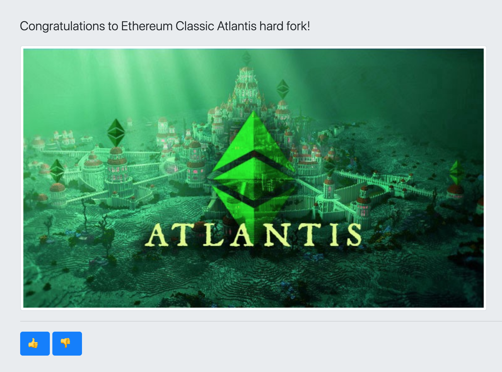
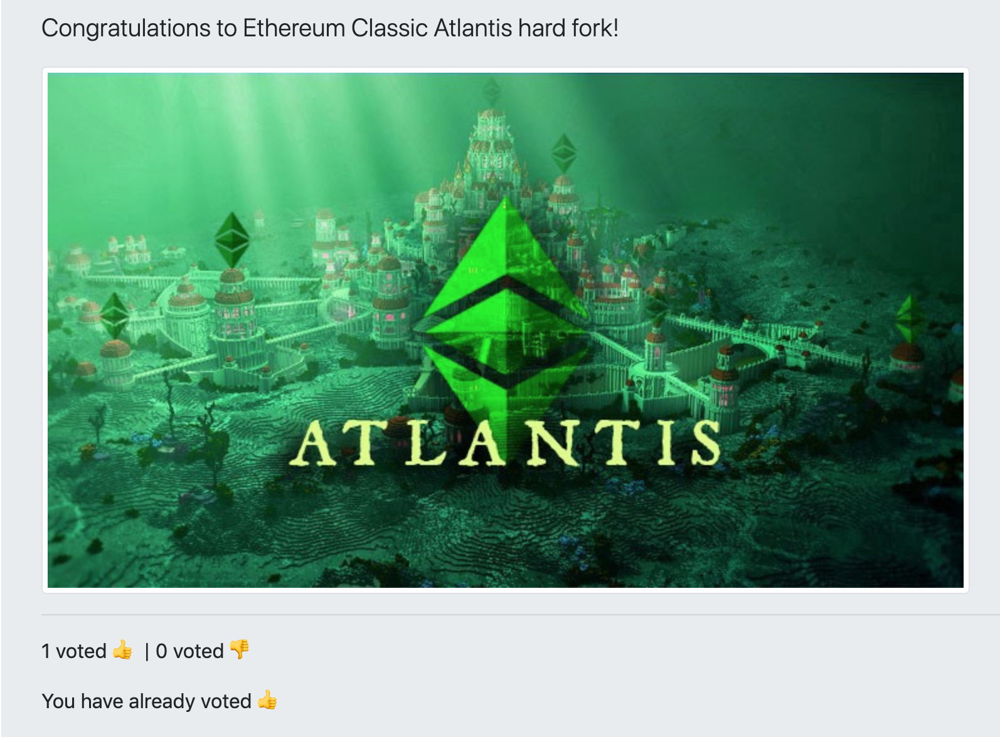

# DEMO: A voting dapp

The example dapp is a web application where people can vote thumb up or thumb down on a statement. All the votes are recorded on the blockchain, and since gas is required, only ETC token holders can vote.

