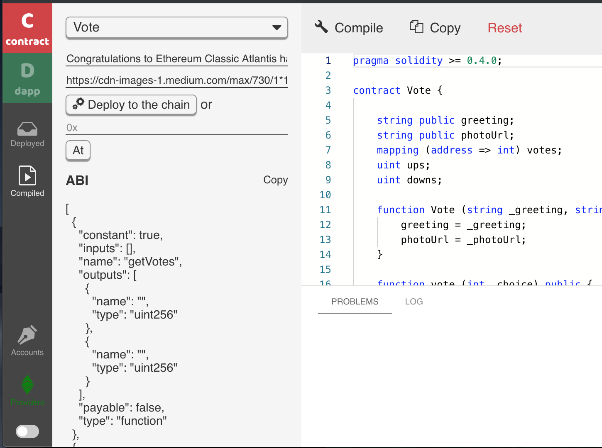
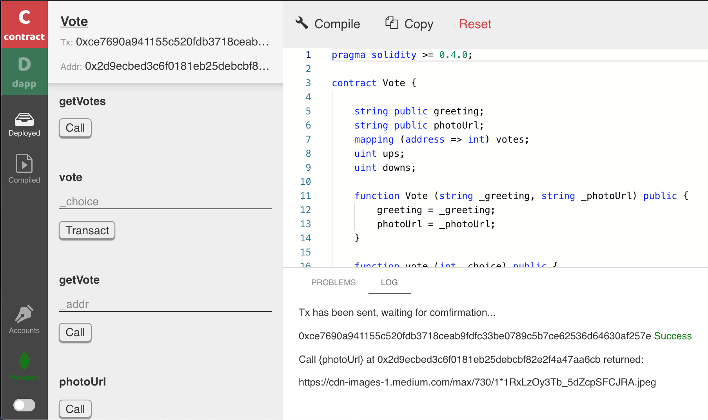
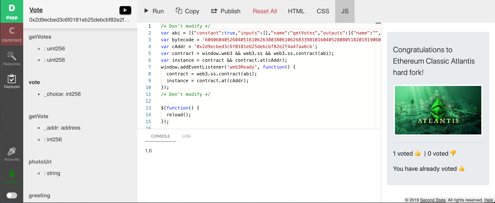

# Ethereum Classic

## **Step 1** 

Open the BUIDL IDE tool in any browser. [http://buidl.secondstate.io/etc](http://buidl.secondstate.io/etc)

## **Step 2** 

Open the Accounts tab and send a little ETC to your default account. If you do not have ETC, you can ask for some from etc@secondstate.io


If you have Metamask for ETC, you could opt to use Metamask in the Providers tab. BUIDL and dapps it creates will now use the default account in Metamask to make contract calls and to pay for gas.


## **Step 3** 

### 3.1 Copy and paste the following code to the contract section of BUIDL.

The smart contract is very simple. It provides the text and image url to be voted on, and keeps a record of votes. The `vote()` method is called by voters to vote thumb up or down. The contract is to be compiled by Solidity 0.4.2, and hence the syntax is a little dated.

```typescript
pragma solidity >= 0.4.0;

contract Vote {

    string public greeting;
    string public photoUrl;
    mapping (address => int) votes;
    uint ups;
    uint downs;

    function Vote (string _greeting, string _photoUrl) public {
        greeting = _greeting;
        photoUrl = _photoUrl;
    }

    function vote (int _choice) public {
        if (votes[msg.sender] != 0) { throw; }
        if (_choice != 1 && _choice != -1) { throw; }
        votes[msg.sender] = _choice;
        if (_choice == 1) ups++;
        if (_choice == -1) downs++;
    }

    function getVotes () public constant returns (uint, uint) {
        return (ups, downs);
    }

    function getVote (address _addr) public constant returns (int) {
        return votes[_addr];
    }
}
```


If you are not using MetaMask for ETC as the Provider, please open the Accounts tab and make sure that the default address has a little ETC.


### 3.2 Click on Compile and you will see the following. Enter your text and image URL to be voted on, and then click on deploy on chain.



The contract is now deployed on the ETC blockchain, and you can call its functions directly from inside BUIDL.



### 3.3 Go to the dapp section. Click on the Resources tab, and add the following as resources.

* CSS: [https://stackpath.bootstrapcdn.com/bootstrap/4.3.1/css/bootstrap.min.css](https://stackpath.bootstrapcdn.com/bootstrap/4.3.1/css/bootstrap.min.css)
* JavaScript: [https://code.jquery.com/jquery-3.4.1.min.js](https://code.jquery.com/jquery-3.4.1.min.js)

### 3.4 Next, copy and paste the following HTML code into the HTML editor.

```markup
<div class="container">
   <br/>
   <div class="jumbotron">
      <p class="lead" id="greeting"></p>
      <div id="imageDiv" style="display:none">
         
      </div>
      <hr/>
      <p id="votes" style="display:none">
         <span id="ups"></span> voted 👍 |
         <span id="downs"></span> voted 👎
      </p>
      <form id="form" class="form-inline" style="display:none">
         <button id="voteUp" type="button" onclick="return vote(1);" class="btn btn-secondary mb-2">👍</button>
         <button id="voteDown" type="button" onclick="return vote(-1);" class="btn btn-secondary mb-2">👎</button>
      </form>
      <div id="formSubmitted" style="display:none">Please wait 20 seconds ...</div>
      <div id="myVoteUp" style="display:none">You have already voted 👍</div>
      <div id="myVoteDown" style="display:none">You have already voted 👎</div>
   </div>
</div>
```

### 3.5 Copy and paste the following JavaScript code into the JS editor.

```javascript
var instance = null;
window.addEventListener('web3Ready', function() {
  var contract = web3.ss.contract(abi);
  instance = contract.at(cAddr);
  reload();
});

function reload() {
    instance.greeting(function (e, r) {
        $("#greeting").html(r);
    });
    instance.photoUrl(function (e, r) {
        if (!e && r) {
            $("#imageDiv").css("display", "block");
            $("#image").attr("src", r);
        }
    });
    instance.getVotes(function (e, r) {
        if (!e && (r[0] > 0 || r[1] > 0)) {
            $("#votes").css("display", "block");
            $("#ups").text(r[0]);
            $("#downs").text(r[1]);
        }
    });

    $("#form").css("display", "none");
    $("#formSubmitted").css("display", "none");
    web3.ss.getAccounts(function (e, address) {
        if (!e) {
            instance.getVote(address, function (ee, r) {
                if (r == 1) {
                    $("#myVoteUp").css("display", "block");
                } else if (r == -1) {
                    $("#myVoteDown").css("display", "block");
                } else {
                    $("#form").css("display", "block");
                }
            });
        }
    });
}

function vote (choice) {
    web3.ss.getAccounts(function (e, address) {
        if (!e) {
            $("#form").css("display", "none");
            $("#formSubmitted").css("display", "block");
            instance.vote(choice, {
                gas: 400000,
                gasPrice: 15000000000
            }, function (ee, result) {
                if (ee) {
                    window.alert("Failed. Check if there is at least 0.1 ETC (for gas fee) in your account " + address);
                }
            });
            setTimeout(function () {
                reload ();
            }, 20 * 1000);
        }
    });
    return false;
}
```

### 3.6 Click on Run to see the dapp in action! You can now vote thumb up or down inside BUIDL.



### 3.7 Finally, you can publish the dapp. 

Just click on the Publish button and give the dapp a name. Once published, you can share the published URL to the public to vote on your issue!


If the dapp user has MetaMask for ETC installed, the dapp will ask whether she would like to use her MetaMask account instead of auto-generated or imported accounts.



