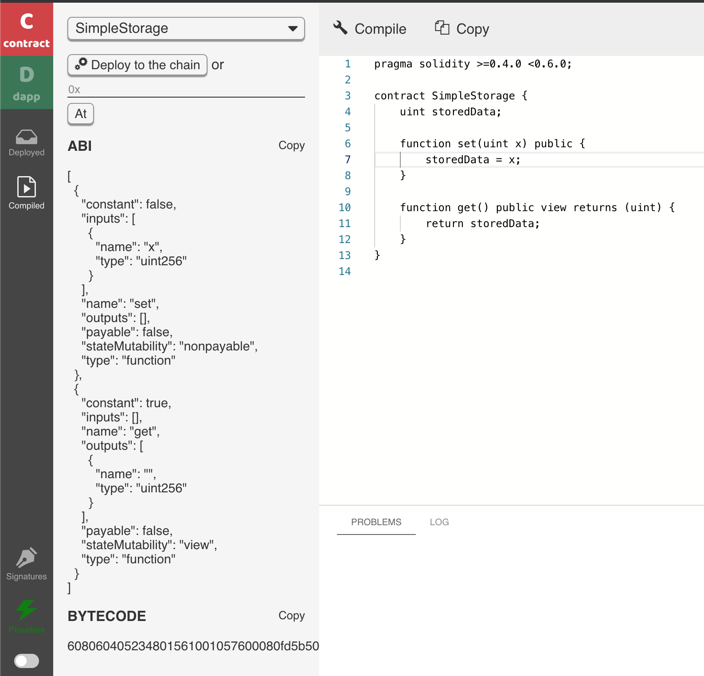
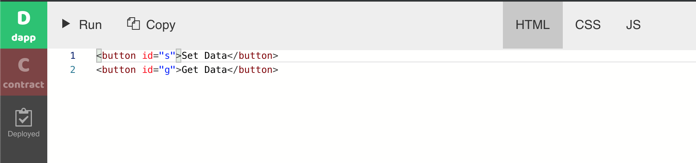

# Getting started

In this section, we will walk through the default example that comes with the [BUIDL](http://buidl.secondstate.io/) IDE. The complete source code for this example is [available here](https://gist.github.com/juntao/2f2cbd734bbc3ef8ddae38f4e2ea89dc).


BUIDL works with the [Second State DevChain](../devchain/getting-started.md) by default. It could also work with any [blockchain started by the Second BaaS](working-with-baas.md) service, as well as any [Ethereum compatible blockchains](working-with-ethereum.md).


Load the [BUIDL](http://buidl.secondstate.io/) web site, and you will see a simple smart contract already in the editor.


The contract simply allows you to store a number on the blockchain. You can view or update the stored number by calling its functions `get()` and `set()`.

```text
pragma solidity >=0.4.0 <0.6.0;

contract SimpleStorage {
    uint storedData;

    function set(uint x) public {
        storedData = x;
    }

    function get() public view returns (uint) {
        return storedData;
    }
}
```

Click on the **Compile** button to compile the contract. A side bar will open to show you the compiled ABI and bytecode of the contract.



Next, you can instantiate and deploy the contract to the [Second State DevChain](../smart-contracts-search-engine/getting-started.md). You can interact with deployed contracts by calling its public methods from inside [BUIDL](http://buidl.secondstate.io/).


Once deployed, you can click on the **dapp** button on the left bar to work on your DApp.



The HTML tab shows a simple HTML page with two buttons.

```text
<button id="s">Set Data</button>
<button id="g">Get Data</button>
```

Next, go to the JS tab. It shows JavaScript on how to interact with the smart contract.


The JS has four sections. The first section is `Don't modify` as it is populated by the BUIDL tool itself. It contains code to instantiate the contract you have just deployed via BUIDL.

```text
/* Don't modify */
var abi = [{"constant":false,"inputs":[{"name":"x","type":"uint256"}],"name":"set","outputs":[],"payable":false,"stateMutability":"nonpayable","type":"function"},{"constant":true,"inputs":[],"name":"get","outputs":[{"name":"","type":"uint256"}],"payable":false,"stateMutability":"view","type":"function"}];
var contract = web3.ss.contract(abi);
var instance = contract.at('0xa6731e3ad59fd8ffe7d786c6384a1f3b0d3d8bd9');
/* Don't modify */
```

The second section shows you how to use the Second State smart contract search service. It takes the contract you just deployed, and finds all deployed contracts of the same type. It just logs the search results to console right now. But in the next example, I will show you how to use the search results.

```text
esss.shaAbi(JSON.stringify(abi)).then((shaResult) => {
  var sha = JSON.parse(shaResult).abiSha3;
  esss.searchUsingAbi(sha).then((searchResult) => {
    console.log(searchResult);
  });
});
```

The third section is the event handler for the **Set Data** button. It shows how to call the smart contracts set function in a transaction from JavaScript.

```text
document.querySelector("#s").addEventListener("click", function() {
  var n = window.prompt("Input the number:");
  n && instance.set(n);
});
```

The last section is the event handler for the **Get Data** button. It calls the smart contract’s get function and displays the result.

```text
document.querySelector("#g").addEventListener("click", function() {
  console.log(instance.get().toString());
});
```

Finally, click on the **Run** button to run the DApp. You will see the DApp UI to the right. You can click on the **Set Data** button to store a number, and **Get Data** button to retrieve the stored number.


Congratulations. You now have a complete DApp deployed on a public blockchain! 

Next, you could explore how to develop more complex DApps on BUIDL, such as [data driven DApps](access-contracts-data.md) or [rules-based DApps](rule-based-smart-contract.md).


