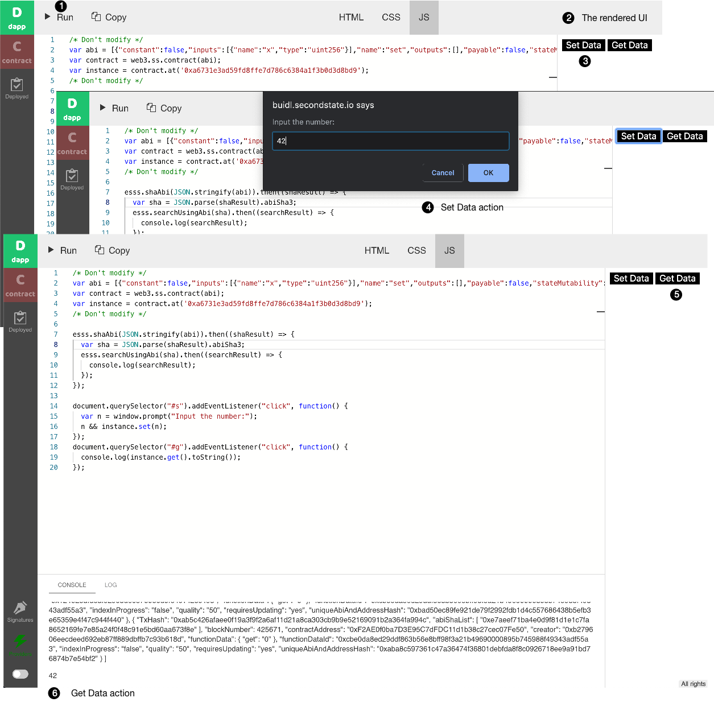

# Getting started

In this section, we will walk through the default example that comes with the [BUIDL](http://buidl.secondstate.io/) IDE. The complete source code for this example is [available here](https://github.com/second-state/buidl/tree/master/demo/default).

**Access the BUIDL IDE from your browser:** [**https://buidl.secondstate.io/**](https://buidl.secondstate.io/)\*\*\*\*


BUIDL works with the [Second State DevChain](../devchain/getting-started.md) by default. It could also work with any [blockchain started by the Second BaaS](working-with-baas.md) service, as well as any [Ethereum compatible blockchains](working-with-ethereum.md).


#### Step 1: Create and deploy a simple Solidity smart contract

Load the [BUIDL](http://buidl.secondstate.io/) web site, and you will see a simple smart contract already in the editor.


The contract simply allows you to store a number on the blockchain. You can view or update the stored number by calling its functions `get()` and `set()`.

Click on the **Compile** button to compile the contract. A side bar will open to show you the compiled ABI and bytecode of the contract.


Next, you can instantiate and deploy the contract to the [Second State DevChain](../smart-contracts-search-engine/getting-started.md). You can interact with deployed contracts by calling its public methods from inside [BUIDL](http://buidl.secondstate.io/).


#### Step 2: Create a UI in HTML

Once deployed, you can click on the **dapp** button on the left bar to work on your DApp.


The HTML tab shows a simple HTML page with two buttons.

#### Step 3: Create JS script to interact with the smart contract

Next, go to the JS tab. It shows JavaScript on how to interact with the smart contract.


The JS has four sections. The first section is `Don't modify` as it is populated by the BUIDL tool itself. It contains code to instantiate the contract you have just deployed via BUIDL.

The second section shows you how to use the Second State smart contract search service. It takes the contract you just deployed, and finds all deployed contracts of the same type. It just logs the search results to console right now. But in the next example, I will show you how to use the search results.

The third section is the event handler for the **Set Data** button. It shows how to call the smart contracts set function in a transaction from JavaScript.

```javascript
document.querySelector("#s").addEventListener("click", function() {
  var n = window.prompt("Input the number:");
  n && instance.set(n);
});
```

The last section is the event handler for the **Get Data** button. It calls the smart contract’s get function and displays the result.

```javascript
document.querySelector("#g").addEventListener("click", function() {
  console.log(instance.get().toString());
});
```

#### Step 4: Run the DApp

Finally, click on the **Run** button to run the DApp. You will see the DApp UI to the right panel. You can click on the **Set Data** button to store a number, and **Get Data** button to retrieve the stored number.



Congratulations. You now have a complete DApp deployed on a public blockchain! 

Next, you could explore how to develop more complex DApps on BUIDL, such as [data driven DApps](access-contracts-data.md) or [rules-based DApps](rule-based-smart-contract.md).


