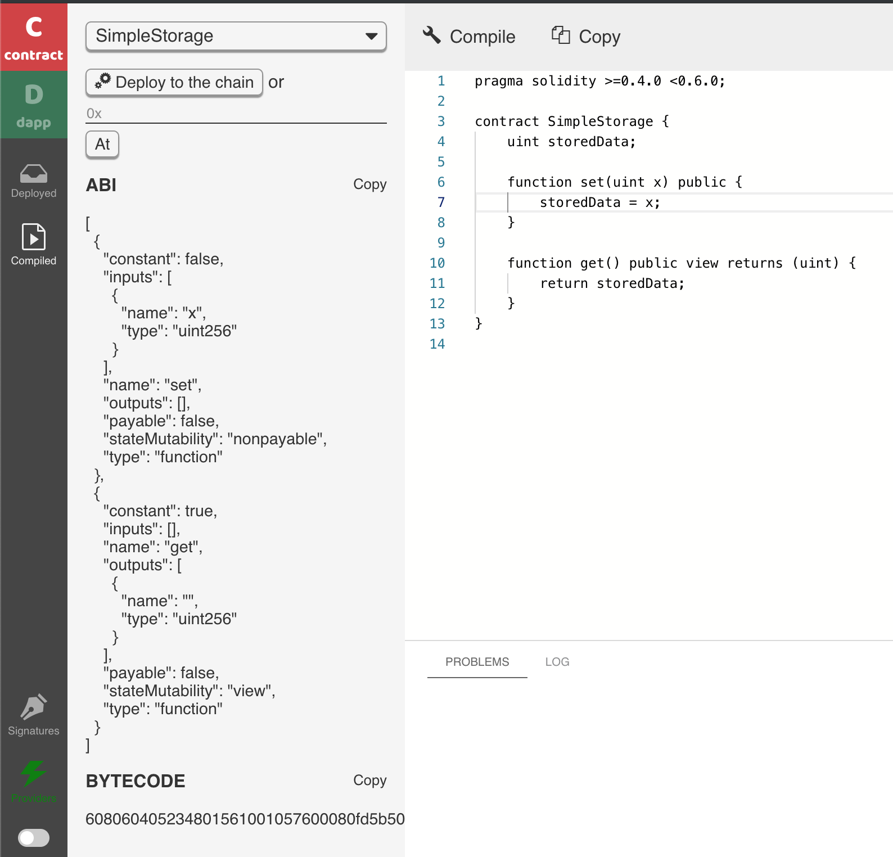
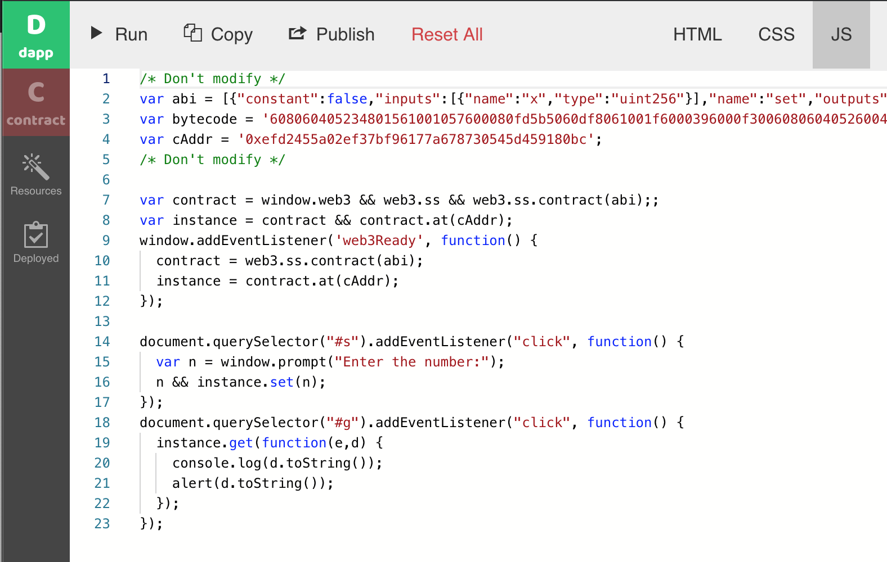

# Getting started

In this section, we will walk through the default example that comes with the [BUIDL](http://buidl.secondstate.io/) IDE. The complete source code for this example is [available here](https://github.com/second-state/buidl/tree/master/demo/default).

**Access the BUIDL IDE from your browser:** [**https://buidl.secondstate.io/**](https://buidl.secondstate.io/)\*\*\*\*




BUIDL works with the [Second State DevChain](../../devchain/getting-started/) by default. It could also work with any [blockchain started by the Second BaaS](../working-with-baas.md) service, as well as any [Ethereum compatible blockchains]().


#### Step 1: Create and deploy a simple Solidity smart contract

Load [BUIDL](http://buidl.secondstate.io/) in your web browser. You will see a simple smart contract already in the online editor window.

The contract simply allows you to store a number on the blockchain. You can view or update the stored number by calling its functions `get()` and `set()`.

Click on the **Compile** button to compile the contract. A side bar will open to show you the compiled ABI and bytecode of the contract.

Next, you can press the **Deploy to the chain** button on the left panel to instantiate and deploy the contract to the [Second State DevChain](../../smart-contracts-search-engine/getting-started.md). You can interact with deployed contracts by calling its public methods from inside [BUIDL](http://buidl.secondstate.io/) -- you can **set** its value and click on the **Transact** button to save the value onto the blockchain, and then click on the **Call** button to see the value in the **LOG** panel.

#### Step 2: Create a UI in HTML

Once deployed, click on the **dapp** button on the left bar to work on your DApp.

The HTML tab above shows a simple HTML page with two buttons.

#### Step 3: Create JS script to interact with the smart contract

Next, go to the JS tab. It shows JavaScript on how to interact with the smart contract.

Finally, click on the **Run** button to run the DApp. You will see the DApp UI in the right panel. You can click on the **Set Data** button to store a number, and **Get Data** button to retrieve the stored number.

Congratulations. You now have a complete DApp deployed on a public blockchain! 

Next, you could explore how to develop more complex DApps on BUIDL, such as [data driven DApps](../access-contracts-data/) or [rules-based DApps](../rule-based-smart-contract.md).

