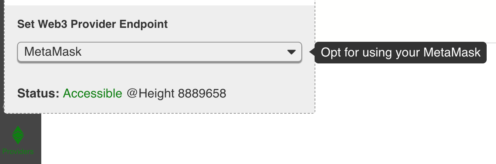
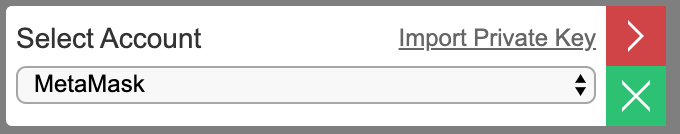

# MetaMask notes

## Developers

If you have MetaMask installed, you can use MetaMask \(or Venus for CMT\) as the web3 provider for BUIDL. Just select MetaMask \(or Venus\) from the **Providers** tab. BUIDL will use MetaMask account to pay gas for deploying or calling contracts. The web3 instance in the dapp will also now come from MetaMask.

However, when you publish the dapp, you will be asked to fill in a "backup" web3 provider since we cannot assume all users also have MetaMask installed.

## Users

If a user has MetaMask \(or Venus for CMT\) installed, she can switch to MetaMask or Venus at the account switcher on the published dapp. The dapp will use the web3 object from the MetaMask or Venus account.

