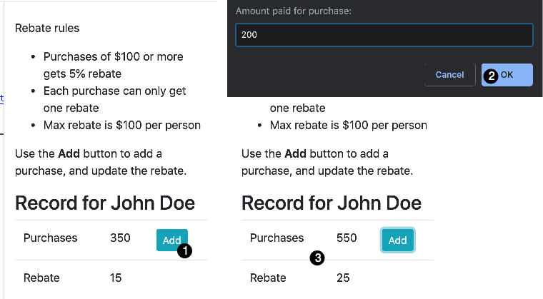
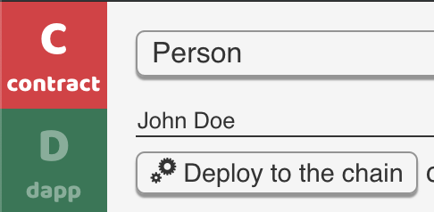

# Rule-based smart contract

Smart contracts a rule-based systems. The Second State smart contract platform supports a [formal rules language](https://www.litylang.org/business_rules/) inside smart contracts. The rules language makes it easy to write rigorous and correct smart contracts, and in turn, smart contracts make business rules transparent and more collaborative. The complete source code for this example is [available here](https://github.com/second-state/buidl/tree/master/demo/rules).

**Access the BUIDL IDE from your browser:** [**https://buidl.secondstate.io/**](https://buidl.secondstate.io/)\*\*\*\*



Let’s first see how the DApp works. It show a contract that calculates rebates for a customer based on rules. The customer gets 5% rebate, up to $100, for every purchase that is $100 or more. You can click on the **Add** button to simulate a purchase made by this user. The contract automatically computes the rebate as soon as a new purchase is made.



#### Step 1: Copy and paste the following code into contract tab

```typescript
pragma lity ^1.2.6;

contract Person {
    struct Purchase {
        int price;
        bool rebated;
    }
    struct Total {
        int paid;
        int rebate;
    }
    string name;
    Purchase purchase;
    Total total;

    constructor (string _name) public {
        name = _name;
        total = Total (0,0);
        factInsert total;
    }

    function buy (int _price) public {
        purchase = Purchase (_price, false);
        total.paid += _price;

        uint256 idx = factInsert purchase;
        fireAllRules;
        factDelete idx;
    }

    function getInfo () view public returns (string, int, int) {
        return (name, total.paid, total.rebate);
    }

    rule "computeRebate" when {
        p: Purchase(price >= 100, !rebated);
        t: Total(rebate < 100);
    } then {
        p.rebated = true;
        t.rebate += p.price * 5 / 100;
        update p;
        update t;
    }
}
```

The important code segment is at the end of the contract, where we specify how the rebates should be given in a set of formal rules named `computeRebate`. The contract uses `factInsert`, `factDelete`, and `fireAllRules` built-in functions to manage the data and execution of this rule. For more details, you can read the [Lity rules documentation](https://lity.readthedocs.io/en/latest/rule-engine-guide.html).

Compile and deploy the smart contract via the **Compile** and **Deploy** buttons. Notice that the contract requires a constructor parameter. The parameter is a person's name. This contract represents his or her shopping history.



#### Step 2: Copy and paste the follow HTML code into the dapp -&gt; HTML tab

```markup
<!doctype html>
<html lang="en">
  <head>
    <!-- Required meta tags -->
    <meta charset="utf-8">
    <meta name="viewport" content="width=device-width, initial-scale=1, shrink-to-fit=no">
    <!-- Bootstrap CSS -->
    <link rel="stylesheet" href="https://stackpath.bootstrapcdn.com/bootstrap/4.3.1/css/bootstrap.min.css" integrity="sha384-ggOyR0iXCbMQv3Xipma34MD+dH/1fQ784/j6cY/iJTQUOhcWr7x9JvoRxT2MZw1T" crossorigin="anonymous">
    <title>Rule-based rebate</title>
  </head>
  <body>
    <div class="container">
        <p><br/>Rebate rules</p>
        <ul>
            <li>Purchases of $100 or more gets 5% rebate</li>
            <li>Each purchase can only get one rebate</li>
            <li>Max rebate is $100 per person</li>
        </ul>
        <p>Use the <b>Add</b> button to add a purchase, and update the rebate.</p>
        <h3>Record for <span id="name"></span></h3>
        <table class="table">
            <tbody id="tbody">
                <tr>
                    <td>Purchases</td>
                    <td id="purchase"></td>
                    <td><button class='btn btn-info btn-sm' onclick='buy(this)'>Add</button></td>
                </tr>
                <tr>
                    <td>Rebate</td>
                    <td id="rebate"></td>
                    <td></td>
                </tr>
            </tbody>
        </table>
    </div>
  </body>
</html>
```

The HTML page presents a UI that allows users to add purchases for this person. With each purchase, the rebate is re-calculated according to the rule.

#### Step 3: Copy and paste the following into the dapp -&gt; JS tab

```javascript
var contract = window.web3 && web3.ss && web3.ss.contract(abi);
var instance = contract && contract.at(cAddr);
window.addEventListener('web3Ready', function() {
  contract = web3.ss.contract(abi);
  instance = contract.at(cAddr);
  reload();
});

instance.getInfo.call (function (e, r) {
  if (e) {
    console.log(e);
    return;
  } else {
    console.log(r);
    document.querySelector("#name").innerHTML = r[0];
    document.querySelector("#purchase").innerHTML = r[1];
    document.querySelector("#rebate").innerHTML = r[2];
  }
});

function buy (element) {
  element.innerHTML = "Wait ...";
  var n = window.prompt("Amount paid for purchase:");
  n && instance.buy(n);
  setTimeout(function () {
    instance.getInfo.call (function (e, r) {
      if (e) {
        console.log(e);
        return;
      } else {
        document.querySelector("#purchase").innerHTML = r[1];
        document.querySelector("#rebate").innerHTML = r[2];
        element.innerHTML = "Add";
      }
    });
  }, 2 * 1000);
}
```

BUIDL pre-fills the JavaScript with the smart contract's compiled artifacts \(ABI and bytecode\), and its deployed address on the blockchain. The script starts by making a `getInfo()` call against the contract instance \(i.e., a person\) via web3 to get the current state of the contract. 

The `buy()` method prompts the user to enter a purchase amount to add to this person. It waits for 2 seconds and then calls `getInfo()` again to get the updated purchase and rebate information for this person from the blockchain smart contract.

#### Step 4: Hit the Run button to launch the DApp

You will see the web app running inside the right panel. You can now add purchases to the person, and see his or her rebates change.

There is also a more complex example of the rebate rules, which allows you to create new persons \(one contract per person\), and then manage all persons in a table. Try the [source code here](https://github.com/second-state/buidl/tree/master/demo/rules-es).


