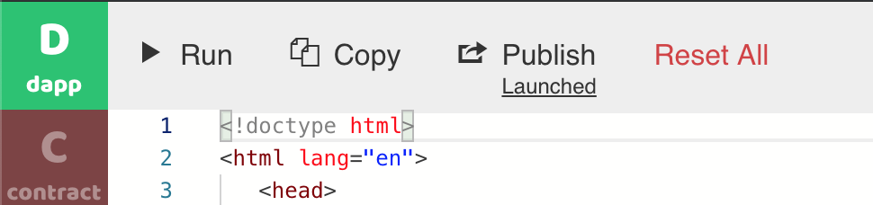
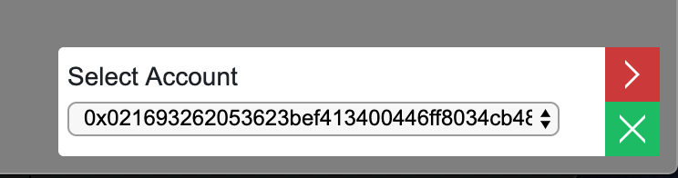

# Sharing your DApp

With the DApp now developed and smart contract deployed on chain, it is easy to share your DApp with family, friends, and colleagues. Just click on the **Publish** button. BUIDL will package the application frontend into a single HTML file and upload it to a public web site. Once it is done, it shows a **Launched** link. Click on that link to open the DApp web site. You can now share this link with anyone.


If you use MetaMask \(or Venus for CMT\) as the web3 provider for BUIDL, you will be asked to provide a "backup" web3 provider when you publish. That is because we cannot assume the dapp users also have MetaMask.


You can also download and save the HTML file from that **Launched** link onto your local computer hard drive. You can put the HTML file on any web host and make it accessible to the world. There are many free services to host your HTML files for the world. Here are some examples.

* [Github pages](https://pages.github.com)
* [Netlify](https://www.netlify.com/)
* [Drive to web](https://drv.tw) for Google Drive

When users comes to the web page to interact with your DApp, they will see a small gadget at the bottom of the page that allows the user to select his or her blockchain address. Note that all those addresses are automatically generated and the selected address serves as the user’s on chain ID.


If the user has MetaMask \(or Venus for CMT\) installed, she will also be able to select MetaMask from the accounts list.


In a production deployment environment, you might need to provision addresses and private keys for your authorized users. For assistance on enterprise use, please contact us.  

