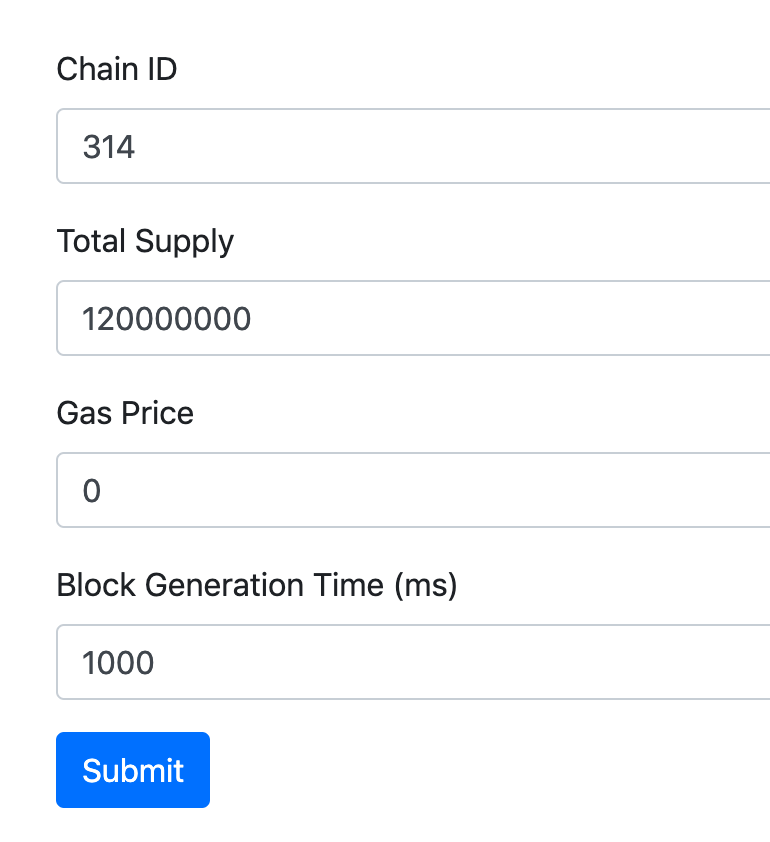
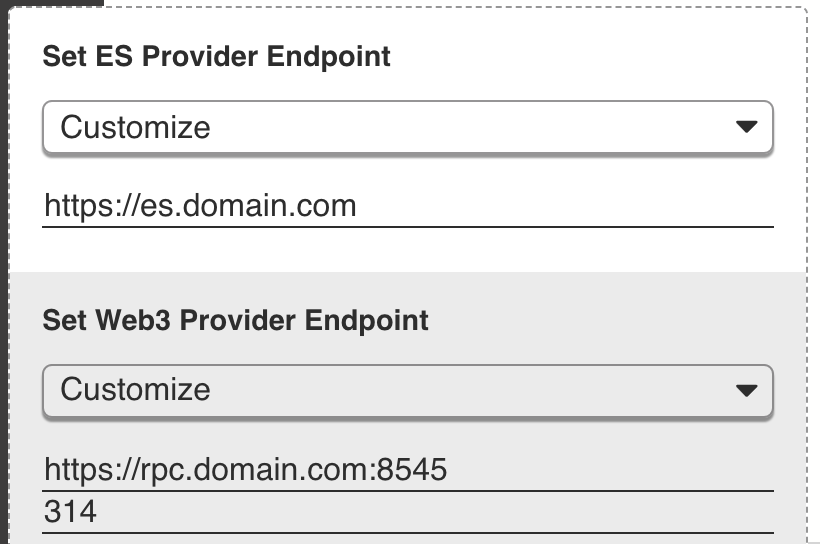

# Working with BaaS

By default, the BUIDL tool works with the Second State DevChain, a high performance public blockchain. However, there are definitely cases when you might want to deploy on your own private or consortium blockchain. The Second State Blockchain as a Service \(BaaS\) enables you to create, customize and deploy a brand new blockchain with one click. Then, you can use BUIDL to develop and deploy on your own blockchain.

First, just go to the Second State BaaS web app and configure your blockchain. It is free of charge during the current pilot period. [Go try it!](http://baas-mvp.secondstate.io/)

It takes a few minutes to create and deploy your new blockchain. Once you are done, you should see the URLs to the new blockchain’s RPC node and ElasticSearch service. Put those URLs into your BUIDL config panel, and all your BUIDL contracts and DApps will now deploy to the new blockchain!

Alternatively, the BaaS site provides a direct link to BUDIL. The link automatically configures BUIDL to use your new RPC and ElasticSearch endpoints.

