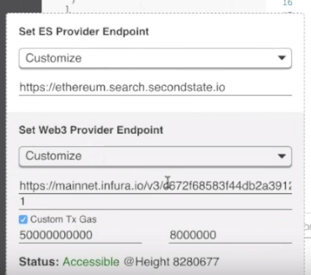

# Working with Ethereum

## Configure BUIDL

You can configure the BUIDL tool from its web interface to deploy smart contracts to Ethereum networks. Click on the **Providers** button on BUIDL's left panel, and enter the following.

* Configure the URL for a web3 provider \(i.e., an Ethereum RPC node\). You could get access to a free node URL from Infura.
* Configure the URL for an ElasticSearch engine for the Ethereum network. For Ethereum mainnet, you could use [https://eth.search.secondstate.io/](https://eth.search.secondstate.io/) 
* Provide a default gas price for contract deployment, when you click on the **Deploy to the chain** button on the BUIDL UI after you **Compile** your contract source code. This value could be 50000000000, which is 50 GWei.
* Provide a block gas limit. It is currently 8000000 for the Ethereum mainnet.



Once these providers are configured, you can use BUIDL to deploy contracts to Ethereum mainnet, and interact with deployed contracts by calling its public functions directly from within the BUIDL UI. The video below shows the entire process.




## Calculating gas

Install [web3 via npm](https://www.npmjs.com/package/web3)

```text
npm install web3
```

Initialize web3

```javascript
const Web3 = require('web3');
const web3 = new Web3(new Web3.providers.HttpProvider("RPC URL HERE"));
```

Fetch the Ethereum Gas Block Limit

```javascript
web3.eth.getBlock("latest", false, (error, result) => {
   console.log(result.gasLimit)
 });
```

Fetch the Ethereum Gas Price

```javascript
web3.eth.getGasPrice((error, result) => {
    console.log(result)
});
```

Click on the green "Providers" section \(located in the lower left hand corner of BUIDL's interface\). Click the "Custom Tx Gas" checkbox and then enter the appropriate gas values.


## Compiling and deploying a contract

