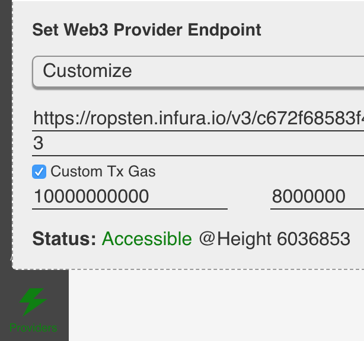

# Working with Ethereum

## Calculating gas
Install [web3 via npm](https://www.npmjs.com/package/web3)
```
npm install web3
```
Initialize web3
```javascript
const Web3 = require('web3');
const web3 = new Web3(new Web3.providers.HttpProvider("RPC URL HERE"));
```
Fetch the Ethereum Gas Block Limit
```javascript
web3.eth.getBlock("latest", false, (error, result) => {
   console.log(result.gasLimit)
 });
 ```
Fetch the Ethereum Gas Price
```javascript
web3.eth.getGasPrice((error, result) => {
	console.log(result)
});
```
Click on the green "Providers" section (located in the lower left hand corner of BUIDL's interface). Click the "Custom Tx Gas" checkbox and then enter the appropriate gas values.


