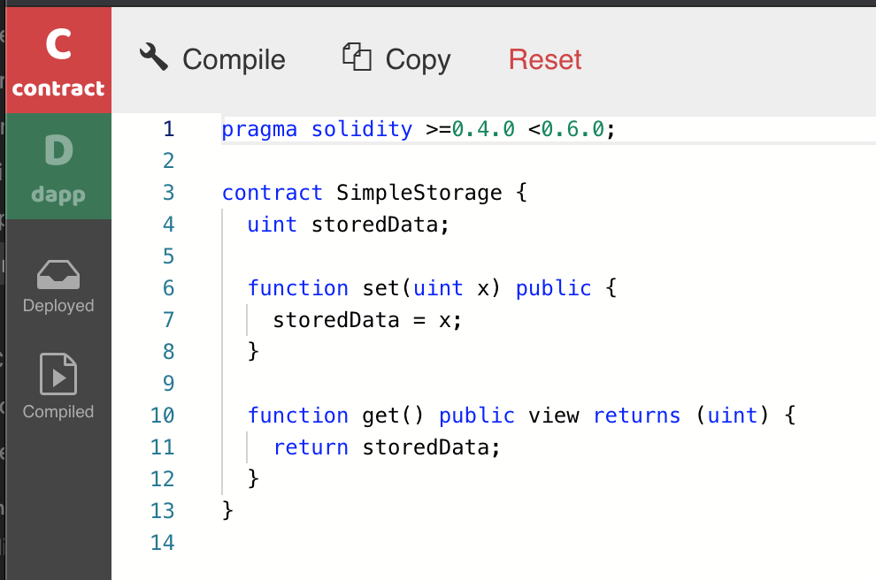
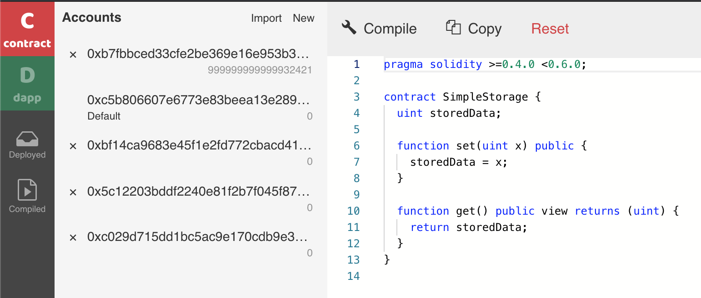
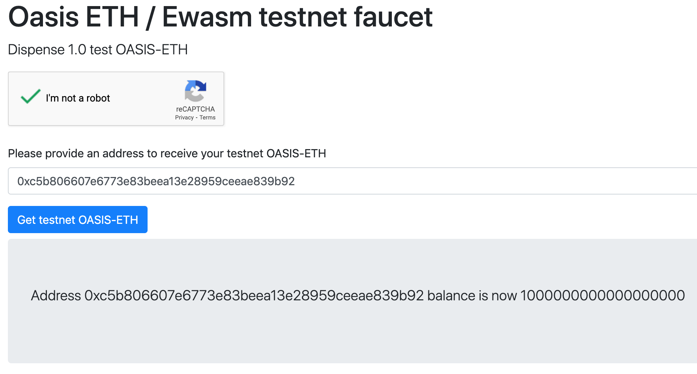
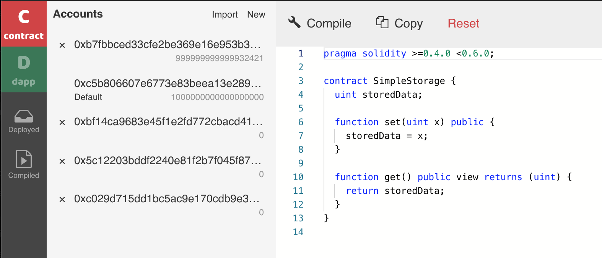
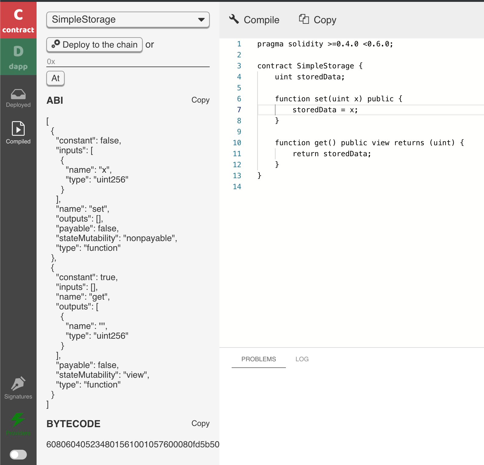
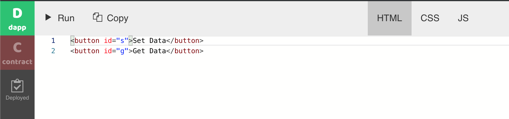
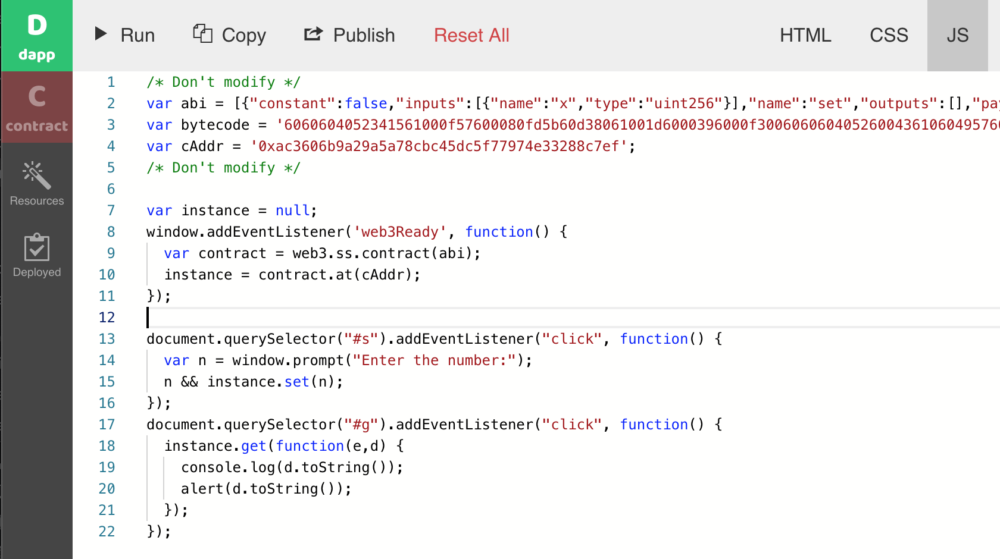
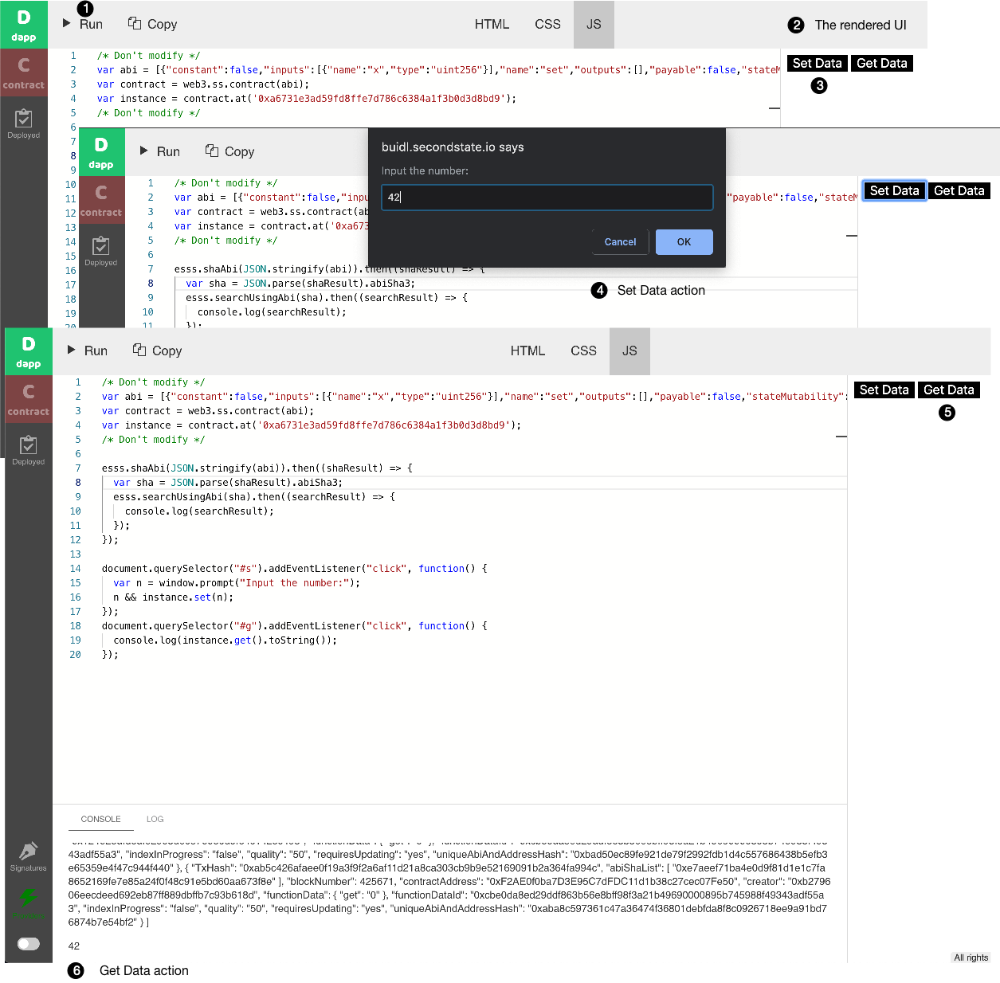

# Getting started

With BUIDL, it is a breeze to develop decentralized applications \(dapps\) on Oasis Network's Ethereum runtime nodes.

## Step1 Configure BUIDL for Oasis Testnet

The easy way is to just click the link below to launch BUIDL in your browser. It pre-loads all the configurations for you. 



## Step 2 Get some testnet Oasis ETH tokens for gas

In the **Accounts** tab, you will see 5 auto-generated addresses, and you can set any of them as default. The default address is used to sign transactions. Because of that, you will need to send a little Oasis ETH into that account to pay for gas fees. 

Go to the faucet web site, enter your default address from BUIDL and give yourself some gas.



Now, go back to BUILD's Accounts tab and you should see 1 ETH \(or 10^18 wei\) in your default address.

## Step 3 Compile and deploy a smart contract

Click on the **Compile** button to compile the contract. A side bar will open to show you the compiled ABI and bytecode of the contract.

Next, you can press the **Deploy to the chain** button on the left panel to instantiate and deploy the contract to Oasis Network Ethereum runtime nodes. You can interact with deployed contracts by calling its public methods from inside [BUIDL](http://buidl.secondstate.io/) -- you can **set** its value and click on the **Transact** button to save the value onto the blockchain, and then click on the **Call** button to see the value in the **LOG** panel.

## Step 4 Create an HTML Dapp

Once deployed, click on the **dapp** button on the left bar to work on your DApp.

The HTML tab above shows a simple HTML page with two buttons.

Next, go to the JS tab. It shows JavaScript on how to interact with the smart contract. It provides event handlers for the buttons. When a user clicks on the button, the JavaScript calls the smart contract functions via the web3 library.

Finally, click on the **Run** button to run the DApp. You will see the DApp UI in the right panel. You can click on the **Set Data** button to store a number, and **Get Data** button to retrieve the stored number.

Congratulations. You now have a complete DApp deployed on the Oasis Network!

