# Tutorial: mint and transfer your own ERC-721\(NFT\) tokens

> Mint an ERC-721 token to represent your digital asset on the Oasis Ethereum ParaTime, and send this newly minted unique token to friends and family! Could worth millions one day, who knows?

This tutorial will walk you through the following tasks.

* How to deploy an ERC-721 smart contract on Oasis Ethereum ParaTime Mainnet.
* Mint an ERC-721 token with an associated digital asset.
* Transfer the ERC-721 Token to another person.

#### 

### What is an ERC-721 Token？

[ERC721 tokens,](https://education.district0x.io/general-topics/understanding-ethereum/erc-721-tokens) more commonly known as Non-Fungible tokens \(NFTs\), have captured developers’ imagination since it was first introduced as an EIP in September of 2017. Non-Fungible tokens allow issuers to tokenize the ownership of digital assets, drastically increasing the design space of what can be represented as a token on the Ethereum and EVM-compatible blockchain.

### **Deploy the ERC-721 smart contract**

Oasis Ethereum ParaTime is fully compatible with the Ethereum protocol. ERC721 smart contracts written in Solidity can be deployed directly to Oasis Ethereum ParaTime without any changes.

You can use an online IDE tool called BUIDL to code and deploy an ERC-721 smart contract on Oasis Ethereum.



**Step 1 Set up MetaMask**

Open **MetaMask**, and select **custom RPC**. Enter the network name and add the RPC link of Oasis Ethereum: [_https://rpc.oasiseth.org:8545_](https://rpc.oasiseth.org:8545/)_._ That configures the MetaMask wallet to use the Oasis Ethereum blockchain.


Then deposit 0.01 OETH to this MetaMask account from t[he OETH developer faucet.](http://faucet.oasiseth.org/)

You can export the private key of this account in MetaMask’s Account details menu.

#### Step 2 Import the MetaMask account address into the BUIDL Account

Next open the BUIDL online IDE for Oasis Ethereum.



Click to open “**account**”, select **Import,** import the MetaMask private key, and you will see your MetaMask account address in BUIDL. You will use this account address to deploy ERC-721 contracts and to mint the NFT tokens.


#### Step 3 compile and deploy the smart contract

Next, choose the Solidity language compiler version in BUIDL. Choose Solidity 0.4.26 here.


Copy and paste the source code into the Contract Tab.

> You can find the ERC-721 smart contract source code [here](https://github.com/second-state/oasis-ssvm-runtime/wiki/ERC-721-Smart-Contract).

```text
......

contract MyNFT is ERC721Full, ERC721Mintable {
    constructor() ERC721Full("MyNFT", "MNFT") public {
  }


  function mintToken(address to, uint256 tokenId, string uri) public {
      mint(to, tokenId);
      require(_exists(tokenId));
      _setTokenURI(tokenId, uri);
  }
  function burnToken(address owner, uint256 tokenId) public {
      _burn(owner, tokenId);
  }

}
```

At the end of the contract code, `contract MyNFT` is to mint the ERC-721 tokens. Here, you can specify a symbol for your ERC-721 tokens.

Click the **Compile** button and select MyNFT to deploy to the blockchain.

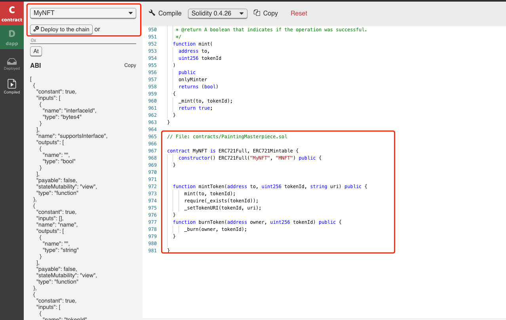

The deployment is successful, and you are now half way through issuing ERC-721 tokens on Oasis Ethereum ParaTime. Call the `totalSupply` function in BUIDL, and see that it returns 0. There is no token in this contract yet. The next step is to mint ERC-721 tokens with digital assets.

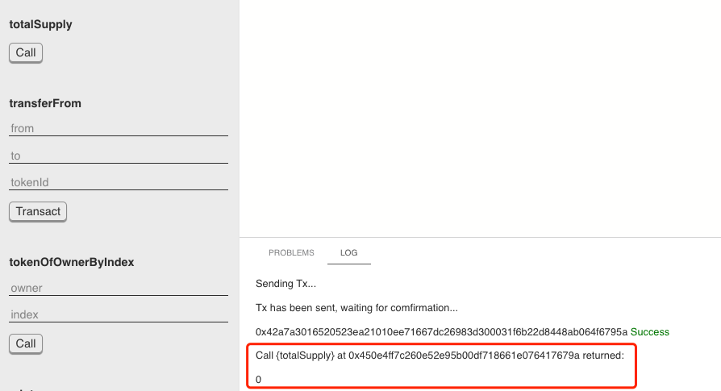

Go to the `mintToken` function. Enter an address in `to` to assign the owner of the new ERC721 token. Enter an integer number in `tokenId` to set the unique id of the ERC721 token. Enter the URL of your digital asset, such as an image or a video, in `uri` to associate the digital asset with the ERC721 token.

Click the Transact button to mint the ERC-721 token. If you want to mint more ERC-721 tokens, simply set other `to, tokenId, uri` parameters in the `mintToken` function. Please note, every token id can only correspond to one digital asset URL. If you want to mint a new ERC-721 token for a new URL, you need to use a different token id.

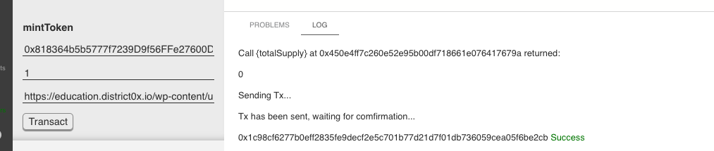

After the Tx is confirmed, we can check the status of the deployed ERC-721 contract and the minted ERC-721 token.

Call the `totalSupply` function again, and it returns 1 this time.

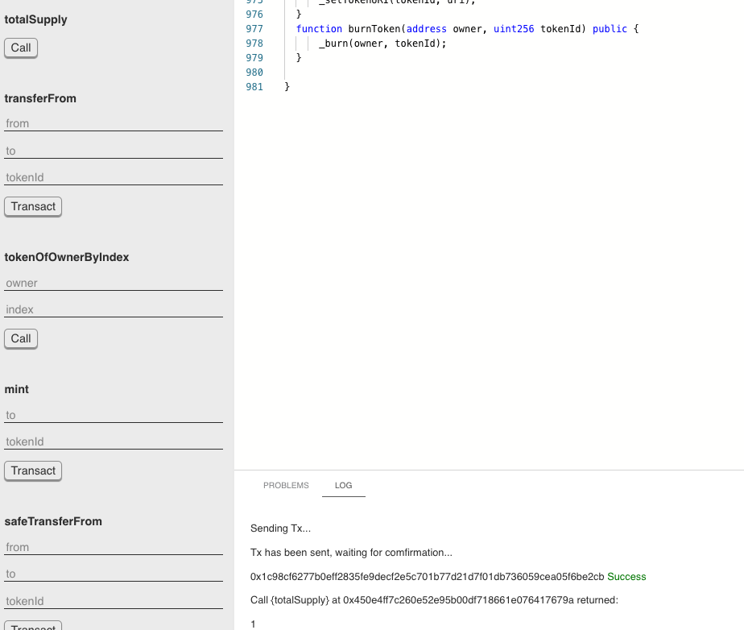

Enter the tokenId and call the `ownerOf` function. It returns the address we just entered in the `mintToken` function.

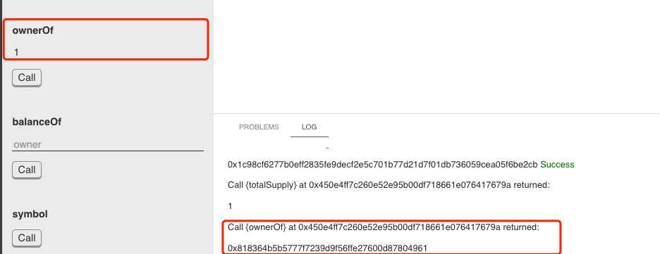

Enter the tokenId and call the `tokenURI` function, it returns the URL we just entered in the `mintToken` function.

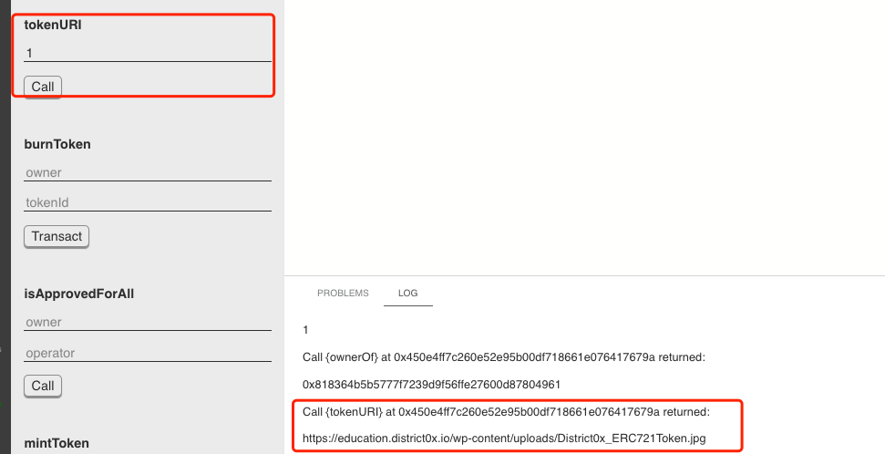

### Transfer the ERC-721 Token

#### Step 1 Get the permission to transfer the ERC-721 Token

The `approve` function gives permission to `to` to transfer `tokenId` token to another account. The function caller must own the `tokenId` token. So we need to import the private key of the owner account of `tokenId` token into BUIDL.

**How to deploy the contract**

> Please ignore this step if you use the same account to deploy the ERC-721 smart contract and receive the minted ERC 721 Token. Just call the `approve` function.

1. Copy the ERC 721 smart contract address.
2. Import your account that received the ERC-721 token.
3. Copy and paste the same smart contract source code.
4. Click the Compile button and choose MyNFT.
5. Paste the ERC 721 contract address and click At. Now, we have an instance to the deployed ERC 721 contract in BUIDL.

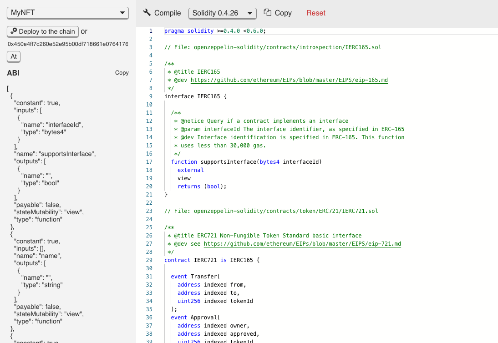

We see the previously deployed ERC-721 contract.

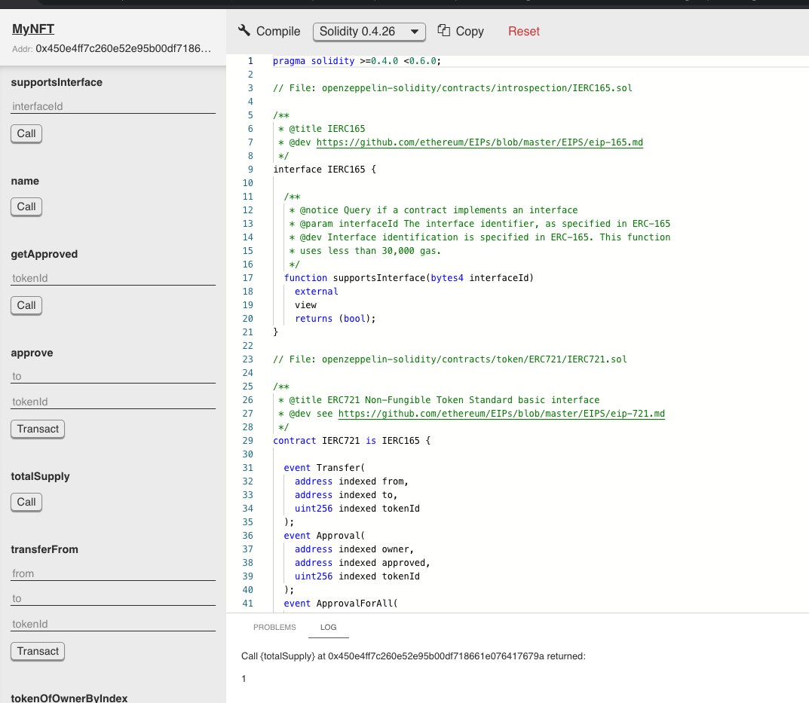

Go to the `approve` function. Enter an address in `to` to assign the receiver of the given ERC721. Enter the id in `tokenId` to transfer the unique NFT Token. Different `tokenId` means different NFT Tokens.

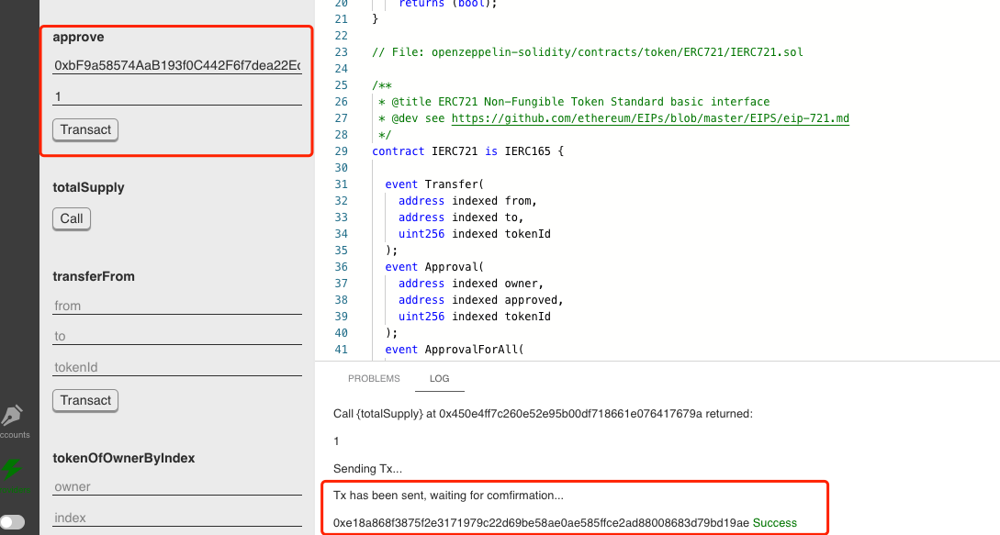

#### Step 2 Transfer the ERC-721 Token

The `safeTransferFrom` function transfers `tokenId` token from `from` to `to`.

Enter the owner's address in `from`. Enter the receiver address in `to` . Enter the id in `tokenId`. The three parameters will make sure you are transferring the correct NFT Token.

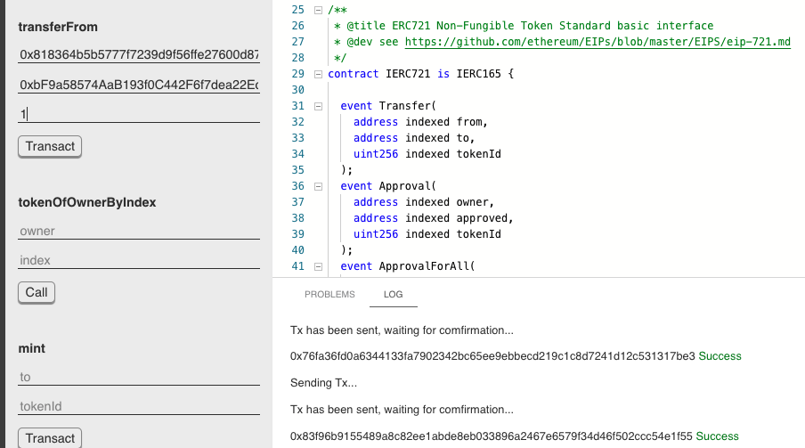

We can call `ownerOf` and `balanceOf` functions to see the status of the given token. The owner of the given token has been transferred to `0xbf9a58574aab193f0c442f6f7dea22ec413db648`.

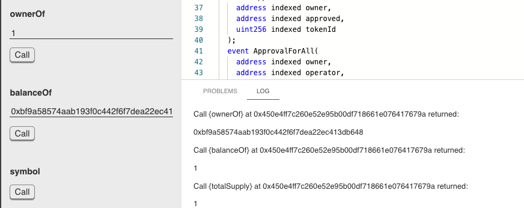

#### Next Step

We will create a web-based Dapp to display and send your NFTs. Stay tuned!

Please remember to save your `token address` and `tokenId`, which need to be submitted to the [hackathon](https://oasisprotocol.org/oasis-eth-hackaton-tcs) organizer through this form.




