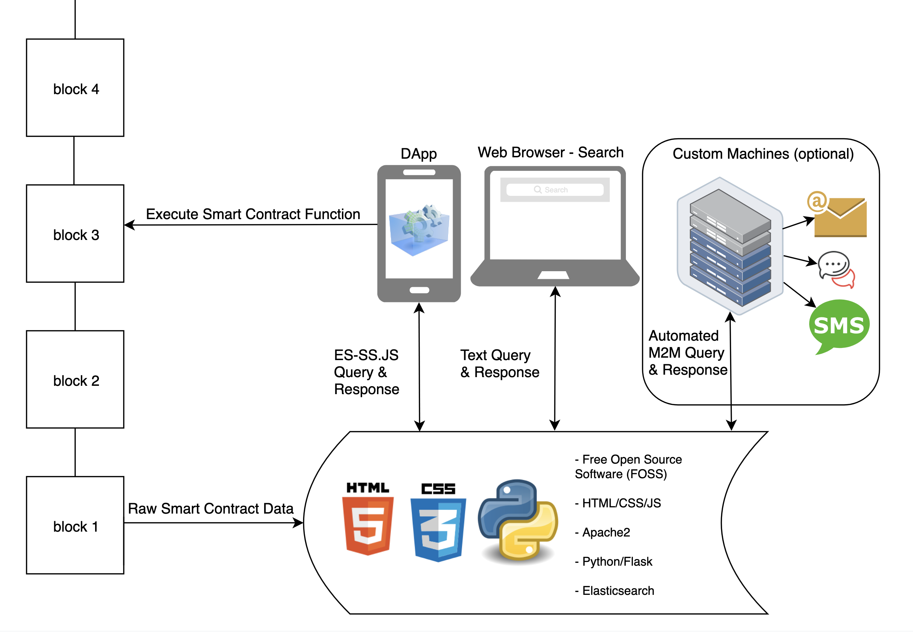
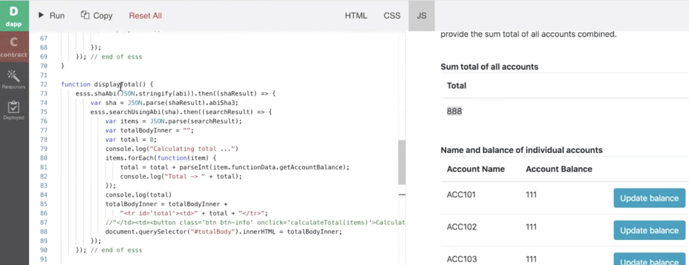

# Getting started

## Overview

The following image illustrates how the smart contract search engine integrates with a) a blockchain, b) a decentralized application (DApp) and any potential c) third-party application and service.



The smart contract search engine can:
 * index any Ethereum compatible blockchain
 * index any number of smart contracts
 * index any number of blocks
 * be called via Curl
 * be queried via client side Javascript
 * be queried via server side NodeJS
 
## Installation

You can quickly install and use your very own smart contract search engine via [a Docker instance](https://github.com/second-state/whitepapers/blob/master/smart-contracts-search-engine/start-a-search-engine-docker.md). Alternatively, you can install and configure the smart contract search engine for use on [your own Ubuntu Server instance](https://github.com/second-state/whitepapers/blob/master/smart-contracts-search-engine/start-a-search-engine.md).

## Usage

### Configuring the smart contract search engine

All of the configuration for the harvesting is stored in [a single, config.ini, Python configuration file](https://github.com/second-state/smart-contract-search-engine/blob/master/python/config.ini). The explaination for each of the configuration settings i.e. rpc endpoint, index names etc. can be found [here](https://github.com/second-state/whitepapers/blob/master/smart-contracts-search-engine/start-a-search-engine.md#configuring-the-python-harvester-a-single-configini-file).

### Harvesting smart contract data (writing blockchain data to the indices)

The core of the smart contract search engine is [a single, harvest.py, Python file](https://github.com/second-state/smart-contract-search-engine/blob/master/python/harvest.py). All of the harvesting functionality resides in the harvest.py file.

#### Recommended usage - running the harvest.py file once at startup

The harvest.py file is designed to manage all of the tasks associated with harvesting. However, due to the vast differences in blockchains (block intervals, number of blocks, number of ABIs, number of contracts etc.) the harvest.py is designed so that each of the separate tasks can be individually called, using the `-m` mode flag. The documentation on how to "run once at startup" can be found [here](https://github.com/second-state/whitepapers/blob/master/smart-contracts-search-engine/start-a-search-engine.md#recommended-usage---run-once-at-startup). However, before you just employ that approach, please take the time to read what each of the modes do. This [Detailed explanation of harvesting modes](https://github.com/second-state/whitepapers/blob/master/smart-contracts-search-engine/start-a-search-engine.md#detailed-explaination-of-harvesting-modes) documentation will help you taylor your search engine's operation to best suit your needs.


#### Using the harvest.py file as a library (useful for testing in certain circumstances)
Whilst technically not the recommended usage, the harvest.py file can also be utilized as a library in the following way. Firstly by starting a Python terminal.

```bash
# Bash syntax
cd /home/smart-contract-search-engine/python
python3.6
```
Then by importing the Harvest code

```python
# Python syntax
from harvest import Harvest
```
Then, the following code will automatically read all of the required configuration from the config.ini file (as the Harvest() object is instantiated as the variable `harvester`).

```python
harvester = Harvest()
```
The above code will allow any of the Harvest functions to be called individually. For example.

```python
_addressHash = "0x123...567"
harvester.getDataUsingAddressHash(_addressHash)
```

 
### Consuming smart contract data (reading blockchain data from the indices)

The smart contract data is consumed on an ABI basis. The smart contract search engine creates a unique deterministic hash of the ABI of a given smart contract. If a DApp wants to access data which is related to an instantiation of that particular smart contract, it can query the indices using the hash as a filter. Consider the following example.

The following smart contract called `ChildContract` produces an ABI.

<details><summary>Click here to see smart contract source code</summary>
<p>
 
```javascript
pragma solidity >=0.4.0 <0.6.0;

contract ParentContract {
    uint parentContractData = 5;

    function setParentContractData(uint _parentContractData) public {
        parentContractData = _parentContractData;
    }
    function getParentContractData() public view returns (uint){
        return parentContractData;
    }
}
contract ChildContract is ParentContract{
    uint childContractData;

    function setChildContractData(uint _childContractData) public {
        childContractData = _childContractData;
    }

    function getChildContractData() public view returns (uint) {
        return childContractData;
    }
}
```
</p>
</details>

<details><summary>Click here to see the ABI</summary>
<p>
 
```javascript
[
  {
    "constant": false,
    "inputs": [
      {
        "name": "_parentContractData",
        "type": "uint256"
      }
    ],
    "name": "setParentContractData",
    "outputs": [],
    "payable": false,
    "stateMutability": "nonpayable",
    "type": "function"
  },
  {
    "constant": true,
    "inputs": [],
    "name": "getChildContractData",
    "outputs": [
      {
        "name": "",
        "type": "uint256"
      }
    ],
    "payable": false,
    "stateMutability": "view",
    "type": "function"
  },
  {
    "constant": true,
    "inputs": [],
    "name": "getParentContractData",
    "outputs": [
      {
        "name": "",
        "type": "uint256"
      }
    ],
    "payable": false,
    "stateMutability": "view",
    "type": "function"
  },
  {
    "constant": false,
    "inputs": [
      {
        "name": "_childContractData",
        "type": "uint256"
      }
    ],
    "name": "setChildContractData",
    "outputs": [],
    "payable": false,
    "stateMutability": "nonpayable",
    "type": "function"
  }
]
```
</p>
</details>

If we look closely at the `ChildContract` we can see that it inherits from the `ParentContract`. If you are thinking that there should technically be two ABIs in relation to the above source code you would be right! Here is the ABI of the `ParentContract`.

<details><summary>Click here to see the ParentContract ABI</summary>
<p>

```javascript
[
  {
    "constant": false,
    "inputs": [
      {
        "name": "_parentContractData",
        "type": "uint256"
      }
    ],
    "name": "setParentContractData",
    "outputs": [],
    "payable": false,
    "stateMutability": "nonpayable",
    "type": "function"
  },
  {
    "constant": true,
    "inputs": [],
    "name": "getParentContractData",
    "outputs": [
      {
        "name": "",
        "type": "uint256"
      }
    ],
    "payable": false,
    "stateMutability": "view",
    "type": "function"
  }
]
```
</p>
</details>

Nested ABIs, like the ones shown above, are very common. In order to provide the most flexibility, the smart contract search engine stores both of the ABIs against any smart contract address which houses an instance of the above deployed `ChildContract`. The hash for the `ParentContract` is `0x5dc306fb7e9065cf256a57f077267b73491a0df567d2aa8c1e89250e96f87011` and the hash for the `ChildContract` is `0xfa13b708346165ef225d79a51acbc17c24b9a2f523b71272fc6160cd9d54ced7`. We can see these hashes in the `abiShaList` section of the raw smart contract data shown below.

<details><summary>Click here to see the raw data example</summary>
<p>
 
```javascript
{
    "took": 0,
    "timed_out": false,
    "_shards": {
        "total": 5,
        "successful": 5,
        "skipped": 0,
        "failed": 0
    },
    "hits": {
        "total": 1,
        "max_score": 1.6739764,
        "hits": [
            {
                "_index": "devchaintwo",
                "_type": "_doc",
                "_id": "0xDd27F736AC616141b72eb67D2d79D3f6b1eD7d6f",
                "_score": 1.6739764,
                "_source": {
                    "TxHash": "0x2e8bab6c377a10747a78bad4cbcd4f56bc8789ad8e4f60848d1bcd6518cf6435",
                    "abiShaList": [
                        "0xfa13b708346165ef225d79a51acbc17c24b9a2f523b71272fc6160cd9d54ced7",
                        "0x5dc306fb7e9065cf256a57f077267b73491a0df567d2aa8c1e89250e96f87011"
                    ],
                    "blockNumber": 2220917,
                    "creator": "0xb0695b88e44c27c8a203bba5aed78e2ae475cc68",
                    "contractAddress": "0xDd27F736AC616141b72eb67D2d79D3f6b1eD7d6f",
                    "functionDataList": {
                        "0": [
                            {
                                "functionDataId": "0x2ea80e958837c05ba351ea4d77e4247518f0ab9df296f632963417c79ceac7f4",
                                "functionData": {
                                    "getChildContractData": "0",
                                    "getParentContractData": "5"
                                },
                                "uniqueAbiAndAddressHash": "0xe666c441714e77c45920a855b1e93c9306f0c8768769627637993c9ae4d15bac"
                            }
                        ]
                    },
                    "requiresUpdating": "yes",
                    "quality": "50",
                    "indexInProgress": "false"
                }
            }
        ]
    }
}
```
</p>
</details>

If we would like to access all instances of the `ChildContract` we could query the search engine using the ABI hash of the `ChildContract`. We can [query using traditional client-side Javascript](https://github.com/second-state/es-ss.js/tree/master/traditional_non_node_js) or [query using server-side NodeJS Javascript](https://github.com/second-state/es-ss.js). Here is an example of both.

#### Client-side Javascript
```javascript
var esss = new ESSS("https://devchain-es.secondstate.io")
abi = '0xfa13b708346165ef225d79a51acbc17c24b9a2f523b71272fc6160cd9d54ced7';
esss.searchUsingAbi(abi)
    .then(function(result) {
        console.log(result)
    })
    .catch(function() {
        console.log("Error");
    });
```

#### Server-side NodeJS Example
```javascript
let esss = require('./es-ss');  
let ESSS = esss.ESSS;
let searchEngineProvider = new ESSS('https://devchain-es.secondstate.io');
abiHash = '0xfa13b708346165ef225d79a51acbc17c24b9a2f523b71272fc6160cd9d54ced7';
var abiSearch = searchEngineProvider.searchUsingAbi(abiHash);
abiSearch.then(function(result) {
    console.log("Result is " + result);
  })
  .catch(function() {
    console.log("Error");
  });
```

The above request queries will return, deduplicated data from the smart contract, such as the following

```javascript
[
  {
    "TxHash": "0x2e8bab6c377a10747a78bad4cbcd4f56bc8789ad8e4f60848d1bcd6518cf6435", 
    "abiShaList": [
      "0xfa13b708346165ef225d79a51acbc17c24b9a2f523b71272fc6160cd9d54ced7", 
      "0x5dc306fb7e9065cf256a57f077267b73491a0df567d2aa8c1e89250e96f87011"
    ], 
    "blockNumber": 2220917, 
    "contractAddress": "0xDd27F736AC616141b72eb67D2d79D3f6b1eD7d6f", 
    "creator": "0xb0695b88e44c27c8a203bba5aed78e2ae475cc68", 
    "functionData": {
      "getChildContractData": "0", 
      "getParentContractData": "5"
    }, 
    "functionDataId": "0x2ea80e958837c05ba351ea4d77e4247518f0ab9df296f632963417c79ceac7f4", 
    "indexInProgress": "false", 
    "quality": "50", 
    "requiresUpdating": "yes", 
    "uniqueAbiAndAddressHash": "0xe666c441714e77c45920a855b1e93c9306f0c8768769627637993c9ae4d15bac"
  }
]
```
### Displaying smart contract data in your DApp

The strength of this system lies in the fact that there is no display configuration or schema required. In addition to this benefit, front-end developers are not required to learn any new skills, other than their existing HTML, JS and CSS. This system only requires that the front-end developer is aware of the smart contract which is driving the DApp which is under construction. Specifically, the frontend developer only needs to know what the ABI hash is. From there the frontend developer can go ahead and create HTML, JS and CSS to suit the requirements of the DApp. Here is an example.

The following Javascript code is from the [Data Drive DApp documentation](https://docs.secondstate.io/buidl-developer-tool/access-contracts-data). 

<details><summary>Click here to see the front-end Javascript</summary>
<p>
```javascript
function displayTotal() {
    esss.shaAbi(JSON.stringify(abi)).then((shaResult) => {
        var sha = JSON.parse(shaResult).abiSha3;
        esss.searchUsingAbi(sha).then((searchResult) => {
            var items = JSON.parse(searchResult);
            var totalBodyInner = "";
            var total = 0;
            items.forEach(function(item) {
                total = total + parseInt(item.functionData.getAccountBalance);
            });
            console.log(total)
            totalBodyInner = totalBodyInner + "<tr id='total'><td>" + total + "</tr>";
            document.querySelector("#totalBody").innerHTML = totalBodyInner;
        });
    }); // end of esss
}
```
</p>
</details>

This code (which uses the ABI hash as a filter) demonstrates that the front-end is only required to parse and iterate through the smallest amount of data. The smart contract search engine does all of the work on the server side and only passes the appropriate slices of filtered data to the DApp's JS and subsequently the HTML output.



You can use the [Data Drive DApp's source code](https://github.com/second-state/buidl/tree/master/demo/data-v2) and try this demonstration in the [SecondState BUIDL tool](http://buidl.secondstate.io/). It literally only takes a few minutes to complete and does not require you to have any cryptocurrency or a wallet. The BUIDL tool works in any browser and even handheld devices such as iPads.


