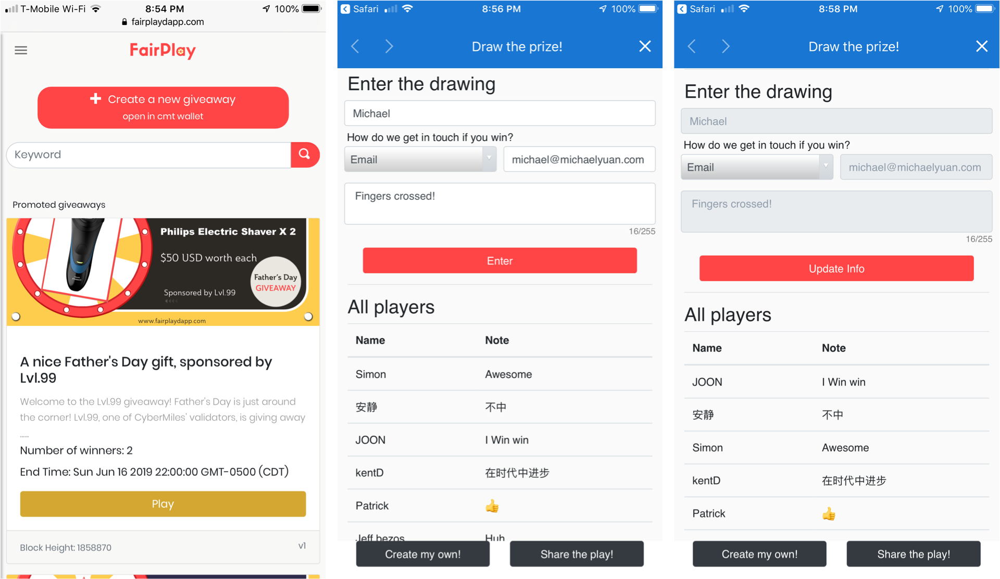

# Middleware for blockchain

Blockchain smart contracts enable enterprises to automate business decisions and processes in a transparent and collaborative environment. Second State creates a suite of open source middleware solutions, including [blockchai](https://github.com/second-state/devchain)n, [virtual machine](https://github.com/second-state/lityvm), [rules engine](https://www.litylang.org/business_rules/), [search engine](https://github.com/second-state/smart-contract-search-engine), data analytics services, together with [development and DevOps tools](https://buidl.secondstate.io/), to support enterprise deployment of smart contracts.

## Smart contracts in enterprises

In the past several years, blockchain technology has seen increasing acceptance by enterprises. However, most enterprise blockchain use cases are still limited to shared ledger. For example,

* Businesses are increasingly accepting mainstream cryptocurrencies, such as BTC and ETH, as a payment option.
* Business to business payments, including inter-bank settlements, are conducted over permissioned blockchains using specialized cryptocurrencies such as Ripple or Stellar.
* Businesses are recording data, such as deeds, legal documents, and product sourcing information, on public and permissioned blockchains.

However, those use cases have only limited business value. The shared ledger only serves as a consensus data store without much intelligence. The true potential of blockchain in enterprises is to serve as a general platform for business computing. For example,

* It could make an automatic payment when a shipment is received.
* It could forfeit deposit when a deadline is missed.
* It could release insurance payout when an accident or disease diagnosis is confirmed.
* It could cancel service plans when a customer stops paying.
* It could compute bonus for employees when they work overtime.
* It could compute rewards for customers when they purchase products.

Currently, such business decisions are made by humans or proprietary application software behind firewalls. Costly disputes and unhappy customers are often the results. A better solution is radical transparency and automation in such business decisions.

Computing tasks performed on the blockchain are completely transparent to participants. The executable code is not only open source but verifiable at runtime. The agreements between parties in business transactions, known as contracts, are now codified as computer programs known as smart contracts.

The blockchain virtual machine is the key infrastructure component to enable diverse smart contracts. Virtual machine-based smart contracts can be written and deployed by any participant at any time without stopping the blockchain. An enterprise could make thousands of business decisions between parties every day, and all those decisions can be codified into smart contracts for automated and guaranteed enforcement.

At Second State, we take an enterprise middleware approach to blockchain infrastructure. While [the decentralized ledger](https://github.com/second-state/devchain) is analogous to a database, [the virtual machine](https://github.com/second-state/lityvm) is analogous to the application server. Smart contracts and blockchain data services are analogous to application services deployed on the application servers.

In the rest of this paper, we will explore how the Second State open source middleware empowers enterprise developers to solve real-world business problems. We will cover topics such as

* [Virtual machine](https://github.com/second-state/lityvm) \(application server\) with enterprise features and optimizations
* Smart contract application services such as [rules engine](https://www.litylang.org/business_rules/) and [search engine](https://github.com/second-state/smart-contract-search-engine)
* [A modular smart contracts](www.fairplaydapp.com) and DApps application framework
* Enterprise-ready data exploration and analytics tools
* [RAD developer tools](https://buidl.secondstate.io/)
* [One-click deployment solutions](http://baas-mvp.secondstate.io/)

Now let’s get started!

## Enterprise-ready smart contracts

[The Second State blockchain virtual machine](https://github.com/second-state/lityvm) is fully compatible with the Ethereum Virtual Machine, but with additional features required by enterprise customers. The Second State smart contract programming language is an extension to the Solidity language. It is called [Lity](www.litylang.org).

### Business rules engine

In today’s enterprises, business rules engines \(BREs\) are widely used to make automated decisions. Rules engines and smart contracts are a perfect match for each other. On one hand, smart contracts are often just rules to be triggered and executed by blockchain transactions. On the other hand, business rules can be guaranteed to execute as written if they are codified in smart contracts. We believe that blockchains are perfect runtimes for rules engines especially when rules need to be audited and verified by multiple parties.

Lity allows users to [create formal business rules in smart contracts](https://www.litylang.org/business_rules/). The Lity rules language constructs are modeled after the popular Drools rules engine. It allows business analysts to create and update rules, and users to verify rules deployed on the blockchain. You can read more about [the Lity rules language here](https://www.litylang.org/business_rules/).

### On-chain and off-chain collaboration

In order to automate real-world business decisions, smart contracts must receive real-world information and events. Lity allows certain smart contracts methods to be only invoked by trusted and verified offline entities known as Oracles.

In Lity, [Oracles](https://www.litylang.org/trusted/) are first class programming constructs supported at the language level. Lity smart contracts could detect and trust transactions from the system’s validator nodes. This allows “ground truth”, such as real-world payment confirmations, product shipping confirmation, medical diagnosis, or even the weather, to be provided to enterprise smart contracts in a transparent and verifiable manner. You can read more about [Lity’s oracle support here](https://www.litylang.org/trusted/).

### More Lity enterprise features

Besides the smart contract rules engine, Lity provides several additional key enhancements to make smart contracts more usable to enterprises.

* Lity provides a native code extension to smart contracts called [libENI,](https://www.litylang.org/performance/) which allows computationally intensive tasks to be delegated to native code.
* Lity provides a comprehensive string library, including a JSON library for processing complex input/output data in smart contracts.
* Lity supports [secure random numbers](https://www.litylang.org/rand/) generated by its block producer nodes.

Taken together, [Lity](www.litylang.org) is the most versatile and enterprise-friendly smart contract platform on the market today.

## Modular application services

Most of today’s DApps \(Decentralized Apps, typically web UI for smart contracts\) rely on a single monolithic smart contract to serve as the “backend”. The smart contract manages all application users and states. Even for systems that consist of multiple contracts, there is typically a registry or manager contract that provides aggregated information about the system.

However, a large smart contract is difficult to write and maintain. It tends to be error-prone, and nearly impossible to fix when an error or issue is discovered, exacerbating the security problems which have plagued DApps to this day. The registry contract is also constrained by the limitations of today’s smart contract programming languages and virtual machines. It cannot support complex data query operations.

A smart contract search engine can serve as the aggregation point of all on-chain data for a DApp. That allows the DApp to have a modular design. By breaking up a monolithic smart contract into many smaller ones, we make smart contracts easier to write, upgrade, and maintain.

For example, the [FairPlay DApp](https://www.fairplaydapp.com/) is a product promotion/giveaway DApp on the CyberMiles public blockchain based on Second State software.

### FairPlay: a case study

[Each FairPlay giveaway event](www.fairplaydapp.com) is its own smart contract. When someone creates a new giveaway, she deploys a new instance of the FairPlay smart contract. That allows us to continuously improve the FairPlay contract to add features and fix bugs.

The FairPlay DApp home screen is the search engine. It allows users to find giveaways containing specific keywords or tags, as well as the user’s previously participated giveaways. The search engine indexes information from all FairPlay contracts deployed on the blockchain.

The search engine-based DApps do not require monolithic smart contracts. Instead, each smart contract in the DApp is designed to complete a limited set of specific business transactions. All related smart contracts are aggregated in the search engine. This pattern allows smart contracts to be modular and focused, while still providing a good end user experience.

## Analytics and insights

The Second State smart contract search engine not only enables new modular DApp designs but also supports analytics of smart contract use on the enterprise blockchain. One of the challenges for blockchains is that transactions \(including smart contract calls\) are recorded chronologically in blocks. It is difficult to get a snapshot view of a specific account or contract at a given point of time. It is also difficult to follow transactions from or to specific addresses over time. That has given rise to blockchain explorers.

The blockchain explorers for legacy blockchains \(eg [EtherScan.io](https://etherscan.io/) and [blockchain.com](https://www.blockchain.com/)\) are focused on providing data for coin transactions. But for enterprise blockchains, coin transactions are often not important. Method calls, events, and state changes in smart contracts are important for enterprise users. The search engine allows us to find contracts of a specific type, examine their current states, and look into the state change history of individual contracts. The data can then be aggregated, graphed, and reported to users.

To see such smart contract search engines in action, check out our live demos on the [Ethereum](https://eth.search.secondstate.io/) and [CyberMiles](https://cmt.search.secondstate.io/) public blockchains.

## Developer tools

Enterprise blockchains built with Second State software all have standard interfaces for users to create, call, and manage smart contracts.

* Blockchain nodes provide network interfaces to accept remote RPC calls. The Second State RPC interfaces are backward compatible with the Ethereum RPC standard.
* The Second State search engine provides an ElasticSearch compatible JSON web services interfaces for queries.
* The node RPC and search engine JSON interfaces can be accessed via JavaScript wrapper libraries [web3-ss.js ](https://github.com/second-state/web3-ss.js)and s[earch-ss.js.](https://github.com/second-state/es-ss.js)

Besides the [web3-ss.js ](https://github.com/second-state/web3-ss.js)and [search-ss.js](https://github.com/second-state/es-ss.js) libraries, Second State provides a suite of open source tools for enterprise developers to create and deploy smart contracts on its software platform.

### Web-based IDE

For beginners, Second State hosts a [web-based IDE,](https://buidl.secondstate.io/) called BUIDL, to develop and deploy Lity smart contracts. You can create Lity smart contracts directly in any modern web browser, compile it to bytecode and ABI, and then deploy to a test blockchain \(ie the[ DevChain](https://github.com/second-state/devchain), see below\).

BUIDL also provides a JavaScript playground to write DApps that interact with the deployed contracts, and the search engine for the test environment. The BUIDL JavaScript playground already has [web3-ss.js](https://github.com/second-state/web3-ss.js) and [search-ss.js](https://github.com/second-state/es-ss.js) configured, and you can immediately start building.

You can access [the public BUIDL tool here](https://buidl.secondstate.io/).

### Command line tools

For more advanced users, Second State provides command line tools for the Lity language. You can compile and build Lity smart contracts using the lityc tool. The Lity command line tool also supports static analysis of smart contracts to ensure their safety and compliance to standards. You can read more about [the Lity static analyzers here](https://www.litylang.org/security/).

### The Second State DevChain

The BUIDL IDE connects to the Second State [DevChain,](http://baas-mvp.secondstate.io/) which is a public testnet running the latest stable software. You can also connect to the DevChain via RPC, ElasticSearch JSON, or web3-ss.js and search-ss.js.

It intends to be a test environment for smart contract and DApp developers. All applications deployed on the DevChain are public.

## Easy deployment

Second State enterprise blockchain and smart contract software is [open source](https://github.com/second-state). You can download the source code from [GitHub](https://github.com/second-state) and build your own enterprise blockchain. Or you can download our automated release builds, including Docker images. All free of charge.

But if you are interested in a worry-free and hassle-free supported solution in the cloud, you could consider the Second State hosted services. You can select features needed for your enterprise blockchain on a web interface, and click one button to deploy a production-ready blockchain across multiple cloud availability zones. The blockchain itself, its connected search engine, and its [BUIDL tools](https://buidl.secondstate.io/) would all be managed by Second State.

Give it a try!

As we had discussed before, a key feature of the Second State blockchain system is that it is very easy to deploy smart contracts on-demand. Once the blockchain is up and running, it is easy to deploy smart contracts onto it via [BUIDL](https://buidl.secondstate.io/), or web3-lity.js, or the node RPC interface.

## Conclusions

Second State provides a full stack of open source middleware to support enterprise applications on blockchains. Try our solutions, and get in touch if you are interested in further collaborations!

