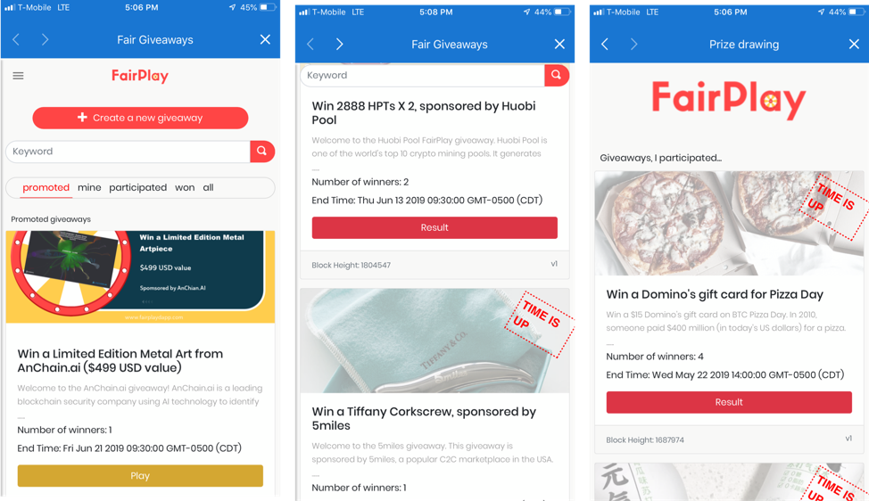

# Google for smart contracts

[Second State](https://www.secondstate.io) has released an [open source blockchain search engine](https://github.com/second-state/smart-contract-search-engine) for smart contracts. It is modular by design; providing flexibility and versatility, as well as scalability. It is the world’s first search engine to provide deep insights into smart contract data and transactions, and hence enable new types of innovative DApps to be developed and supported.

## Background

Blockchain technology is continually gaining popularity in diverse industries. This technology is poised to revolutionize both financial services and e-commerce industries, at a minimum.

Whilst, the original Bitcoin blockchain continues to provide a mechanism to secure and manage a decentralized cryptocurrency ledger, recent advances in blockchain technology have shown that blockchain networks can also be designed to function as general purpose computing platforms, which facilitate rule-based collaborations between untrusted parties.

The first generation of blockchain data browsers were focused primarily on providing snapshots of transaction details. For example, in the case of Bitcoin, displaying verbatim records of structured data; the results of valid transactions executed at the rigid base layer protocol. 

The unprecedented rise of smart contracts, with customized data fields and unique internal programmable logic, has brought about the need for a new mechanism. One which can provide an easy way to search and visualize this new, and rich, unstructured blockchain data.

This mechanism would be analogous to the rise of search engines, as the web grew in the 1990s. However, blockchain networks are unique in that they record all data in a time series of transactions. Smart contract data needs to be indexed and made available to both end-users and machines in real-time. Traditional web search engine technology is seldom used in the blockchain world because the world wide web and blockchain networks are fundamentally different.

## Decentralized Application\(DApps\)

The ethos of decentralization is to empower the individual. In order to achieve this, we need to build software products which can run on inexpensive consumer grade \(store bought\) hardware.

The smart contract search engine can be thought of as a middle layer between a blockchain full node and a decentralized application \(DApp\). This product is an essential part of the future of DApps.

DApps primarily run on lightweight handheld, mobile devices. The continuous overhead of simultaneously storing and broadcasting all information on the blockchain network makes it impossible for mobile devices to participate as full blockchain nodes. Mobile devices need another way to access blockchain data.

It is a well-known fact that mobile and handheld devices have surpassed the traditional desktop PC, in terms of usage, for many years now. Deploying DApps on these smaller, more convenient and more popular, devices is paramount for the adoption and sustainability of DApps.

Second State, an enterprise blockchain startup, has released a[n open source search engine and API](https://ethereum.search.secondstate.io/) which allows DApps to easily access smart contract data on all Ethereum-compatible blockchains.

* For public blockchains, Second State is providing a free search engine service.
* For permissioned blockchains, Second State provides supported open source software to power search engines behind the firewall.
* For DApp developers, Second State provides open source software to build your own search engine as part of the DApp.

Note: DApp stores support DApps searches based on manual tags and labels. They do not search inside DApp smart contracts and do not search for past contract state changes and events caused by transactions. DApp stores are structured directory services \(i.e. Yahoo\) rather than an unstructured search engine \(i.e. Google\).

Now, let’s look into how the search engine gives business insights into smart contracts data. The search engine can make today’s smart contracts much easier to use.

## USE cases

Second State’s new [public search engine for the Ethereum blockchain ](https://eth.search.secondstate.io/)is based on our open source software. Compared with Ethereum blockchain explorers \(such as EtherScan.org\), the Second State public search engine specifically focuses on the data inside smart contracts as opposed to just coin transactions. Here are some more interesting use cases.

### Crypto assets

Crypto assets Crypto assets are represented by a large number of standard contracts such as ERC20, ERC721, and even ERC1400. A search engine could provide an aggregated view of all account balances and transactions across those contracts.

Essentially, every ERC smart contract standard could benefit from a search engine that aggregates and displays information across all contracts of the same type. 

### DeFi 

Decentralized crypto exchanges often have multiple asset pools each represented by a smart contract. A search engine can provide deep insights into the history and current state of those pools.

In general, DeFi \(decentralized finance\) solutions, such as algorithmic stable coins, crypto loans, staking pools, all have asset pools hold by smart contracts. A search engine could provide deep insights into those pools. Stay tuned for more from Second State on this front!

While searching into existing smart contracts is an important capability, it is only part of our story. More significantly, the search engine could enable new DApp designs that deliver enhanced user experience. The [FairPlay DApp](www.fairplaydapp.com) recently released on the CyberMiles public blockchain is a great example. 

### Gaming 

Blockchains allow participants, from anywhere in the world, to play games against each other without the need for a central operator or a trusted setup. A decentralized game is run entirely in accordance with a smart contract’s logic. The smart contract will not allow a player to perform an invalid move, or participate out of turn. The smart contract ensures correctness and fairness, right from the initial rules of engagement through to the final payout or reward.

DApps which constitute the front-end \(a visually stimulating component of the game\) obtain the real-time state of the game, programmatically, via the smart contract search engine API.

The entire ecosystem is safe and reliable. The steps below are repeated until a satisfactory outcome is achieved.

For example:

* The DApp visually displays the current state of the game to the end-users
* If it is their turn, each end-user makes a choice by touching or swiping the screen etc.
* The DApp submits that choice to the smart contract
* The smart contract validates the instruction set which the DApp sent
* The smart contract executes the instruction set if valid
* The smart contract’s state is/isn’t updated accordingly
* The DApp re-displays the current state of the game \(via the API\) to the end-users

## Modular DApps

Most of today’s DApps rely on a single monolithic smart contract to serve as the “backend”. The smart contract manages all application users and states. Even for systems that consist of multiple contracts, there is typically a registry or manager contract that provides aggregated information about the system.

However, a large smart contract is difficult to write and maintain. It tends to be error-prone, and nearly impossible to fix when an error or issue is discovered, exacerbating the security problems that had plagued DApps today. The registry contract is also constrained by the limitations of today’s smart contract programming languages and virtual machines. It cannot support complex data query operations.

A smart contract search engine can serve as the aggregation point of all on-chain data for a DApp. That allows the DApp to have a modular design. By breaking up a monolithic smart contract into many smaller ones, we make smart contracts easier to write, upgrade, and maintain.

For example, the FairPlay DApp is a [product promotion/giveaway DApp](www.fairplaydapp.com) on the CyberMiles public blockchain. With over 1000 DAU, it is one of the most popular blockchain DApps. The design of FairPlay is completely modular.

  

Each giveaway event is its own smart contract. When someone creates a new giveaway, she deploys a new instance of the FairPlay smart contract. That allows us to continuously improve the FairPlay contract to add features and fix bugs.

The FairPlay DApp home screen is the search engine. It allows users to find giveaways containing specific keywords or tags, as well as the user’s previously participated giveaways. The search engine indexes information from all FairPlay contracts deployed on the blockchain.

The search engine-based DApps do not require monolithic smart contracts. Instead, each smart contract in the DApp is designed to complete a limited set of specific business transactions. All related smart contracts are aggregated in the search engine. This pattern is much closer to the design goal of smart contracts, and hence allow the DApp to be more decentralized. 

## The enterprise search engine 

The smart contract search engine is especially useful in permissioned blockchains for enterprises.

A key characteristic of enterprise blockchains is that they tend to codify the repeatable business process into contract transactions. For example, a supply chain management blockchain solution could create a smart contract, modeled after a real-world legal contract, for each escrow payment. A clearinghouse/settlement blockchain could use smart contracts to compute settlement fees and exchange rates, and it could create a new contract for each pair of settlement parties. The search engine allows developers to build DApps that aggregate those contracts and provide a big picture view of the entire business process by connecting relevant contract transactions.

Every Second State managed enterprise blockchain comes with a dedicated search engine. 

## Developers 

To build a smart contract search engine for your own DApp or enterprise blockchain, please follow our instructions to build a Docker image for the search service and then configure it to index specific contracts on a specific blockchain.

To query the search engine or to submit new ABIs to index, you can use the Elastic Search API or use the [es-ss.js](https://github.com/second-state/es-ss.js) JavaScript library. The [es-ss.js](https://github.com/second-state/es-ss.js) library is also bundled in the [BUIDL tool](https://buidl.secondstate.io/) so that you can write search engine-enabled DApps directly from the online IDE. Every smart contract created from BUIDL is automatically indexed by the connected search engine. Check out how to get started with the search engine in BUIDL. 

### Open source community 

The smart contract search engine is completely open source. In its purest form, it uses the following FOSS products/code

* [Ubuntu](https://ubuntu.com/)
* [Apache2](https://httpd.apache.org/ABOUT_APACHE.html)
* [HTML ](https://www.w3schools.com/html/)
* [CSS](https://www.w3schools.com/css/) 
* [Python](https://www.python.org/) 
* [Web3py ](https://web3py.readthedocs.io/en/stable/)
* [Elasticsearch](https://www.elastic.co) 
* [LetsEncrypt](https://letsencrypt.org/)

Whilst it is possible to implement any combination of the above products/code on proprietary services, it is important to note that this smart contract search engine is not dependent on any proprietary systems or services. It will operate at its full capacity using open and free resources.

The presentation layer is built using standard and ubiquitous HTML/CSS/JavaScript. This means that not only is the frontend highly customizable, the presentation layer is able to be customized in parallel by one of your team members with HTML/JS skills. There is no need to learn about new application frameworks. There is also no need to install complex integrated development environments \(IDEs\) or build tools; a simple text editor will suffice, if that is all you have available.

The smart contract search engine is specifically designed to run in many modes. For example, it can be run on localhost \(using HTML/JS and without the need for a web server\). In contrast to this, it can also be run as a global public facing HTTPS website and/or as a public facing HTTPS API data endpoint.

The smart contract search engine allows you to upload one or many smart contract Application Binary Interface \(ABI\) files. Once an ABI is present, the system will sweep through the blockchain and index every contract instance which uses that ABI. Some use cases only require that one or two ABIs be indexed. For example the [FairPlay Product Giveaway DApp ](www.fairplaydapp.com)which currently has both a [version 1](https://github.com/CyberMiles/smart_contracts/tree/master/FairPlay/v1) and [version 2 ](https://github.com/CyberMiles/smart_contracts/tree/master/FairPlay/v2)of its smart contract. Perhaps in some other use cases many more ABIs are required. For example, the [Ethereum Search Engine Demonstration](https://eth.search.secondstate.io/) which has over 100 ABIs. 

### Control and efficiency 

All indexing/harvesting takes place in a single Python file. The functions in this file are reusable for your own custom external tooling. For example, you can [index a smart contract instance in under 10 lines of code](https://github.com/second-state/smart-contract-search-engine/blob/multiple_canonical_abi_support/python/upload_single_abi_and_tx.py). This is useful for rapid development and testing as well as system interoperability. You can easily achieve simple yet powerful and flexible integration of core functionality and even make this part of your public facing APIs.

One example of using the core Python file as a library would be to programmatically index smart contracts as they are created \(in real time\) or focusing on specific block ranges for maximum speed and efficiency.

The smart contract search engine gives you complete control over what is index and when. After all you and your team should not have to maintain an index of 7 million blocks if your DApp was only deployed within the last 100 blocks. 

## What’s next 

We believe that the smart contract search engine and [es-ss.js](https://github.com/second-state/es-ss.js) are complementary to the web3 on-chain data protocol. Together, they enable modular and powerful DApps.

If you are interested in building search engine-based DApps or rich data service for your enterprise blockchain, please get in touch!

